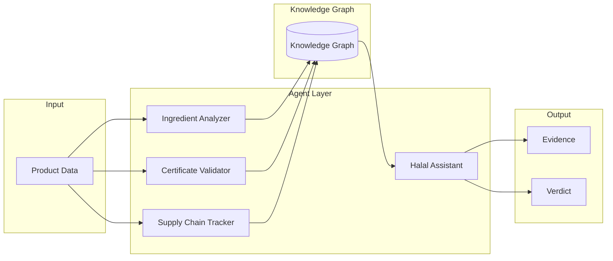

# Agent Orientation — HalalChain AutoClaw Framework

## Overview

HalalChain uses AutoClaw as its multi-agent orchestration framework. This document provides orientation for developers and operators working with the agent system.

## Core Principles

### 1. Separation of Concerns
- **Evidence Collection**: AI agents collect and analyze evidence
- **Policy Evaluation**: Deterministic policy engine renders final verdicts
- **No Override**: AI agents never override policy decisions

### 2. Deterministic Verdicts
- All agents output structured evidence
- Policy engine applies consistent, repeatable rules
- Verdicts are immutable once recorded on blockchain

### 3. Auditability
- Every agent action is logged
- All decisions are traceable
- Full audit trail for compliance

### 4. Security
- Role-based access control
- Encrypted communications
- Secure storage of sensitive data

## Agent Types

### Evidence Collection Agents
Collect and analyze product data:

| Agent | Purpose | Input | Output |
|-------|---------|-------|--------|
| halal-assistant | General evidence collection | Product data | Structured evidence + verdict |
| ingredient-analyzer | Ingredient analysis | Ingredient list | Ingredient classifications |
| certificate-validator | Certificate verification | Certificate details | Validity status |
| supply-chain-tracker | Supply chain analysis | Supplier data | Traceability report |

### Orchestration Agents
Coordinate multiple agents:

| Orchestrator | Purpose | Input | Output |
|--------------|---------|-------|--------|
| halal-orchestrator | Full verification workflow | Product data | Complete verification |
| batch-processor | Bulk processing | Product list | Batch verdicts |
| compliance-auditor | Audit workflow | Product IDs | Audit report |

## Agent Communication



## Agent Lifecycle

1. **Registration**: Agent registers with AutoClaw
2. **Configuration**: Agent loads configuration
3. **Initialization**: Agent initializes resources
4. **Execution**: Agent processes input
5. **Validation**: Output validated against schema
6. **Recording**: Results recorded in audit log
7. **Cleanup**: Resources released

## Best Practices

### For Agent Development

1. **Idempotent**: Agents should produce same output for same input
2. **Structured Output**: Always follow defined schema
3. **Error Handling**: Graceful failure with clear error messages
4. **Logging**: Detailed logs for debugging
5. **Testing**: Comprehensive test coverage
6. **Versioning**: Semantic versioning for agents

### For Orchestration

1. **Parallel Execution**: Run independent agents in parallel
2. **Consensus**: Require consensus for critical decisions
3. **Timeout**: Set appropriate timeouts
4. **Retry**: Implement retry logic with exponential backoff
5. **Fallback**: Define fallback strategies for failures

## Troubleshooting

### Common Issues

| Issue | Solution |
|-------|----------|
| Agent not responding | Check endpoint, restart agent |
| Invalid output | Validate schema, check input |
| Knowledge graph timeout | Check connectivity, optimize query |
| Memory full | Clear cache, increase memory limit |

### Debug Commands

```bash
# Check agent status
autoclaw status agent halal-assistant

# View logs
autoclaw logs --agent halal-assistant --tail 100

# Clear memory
autoclaw memory clear --agent halal-assistant

# Query knowledge graph
autoclaw kg query --type halal_e_codes --filter "status:HARAM"
```

## Version History

| Version | Date | Changes |
|---------|------|---------|
| 1.0.0 | 2026-01-15 | Initial orientation document |
| 1.1.0 | 2026-08-27 | Updated for latest AutoClaw version |
