# HalalChain Marketplace

> **The composable trust infrastructure for the global halal economy.**

HalalChain Marketplace is a multi-participant digital infrastructure platform for connecting the organizations, professionals, technologies, evidence sources, financial services, logistics providers, AI systems, and consumers that participate in the global halal economy.

It is designed to operate beyond a conventional product marketplace.

The platform provides the infrastructure required for participants to:

* establish organizational identity and roles
* declare capabilities
* publish and consume APIs
* exchange verifiable evidence
* manage halal certification workflows
* coordinate audits and laboratory testing
* connect manufacturers and suppliers
* integrate logistics and customs
* connect financial and Islamic-finance services
* publish developer integrations
* deploy AI agents and skills
* use MCP-based integrations
* bring their own API/LLM/infrastructure credentials
* maintain tenant-isolated data
* anchor important evidence to blockchain
* preserve provenance and audit history
* execute deterministic compliance policies
* support government and regulatory verification
* expose trustworthy information to downstream marketplaces and consumers

The central architectural principle is:

> **AI gathers evidence. Deterministic systems decide.**

AI, agents, developers, skills, consultants, external providers, and integrations may collect, transform, classify, summarize, recommend, or propose evidence.

They do **not** independently become the authoritative source of compliance decisions.

Authoritative compliance decisions belong to the platform's deterministic policy and governance boundary, represented by **`tawheed`**, subject to the applicable authority, policy, jurisdiction, certification scheme, and delegated permissions.

---

# Table of Contents

* [1. Vision](#1-vision)
* [2. What Is HalalChain Marketplace?](#2-what-is-halalchain-marketplace)
* [3. The Core Problem](#3-the-core-problem)
* [4. The HalalChain Model](#4-the-halalchain-model)
* [5. Core Principle](#5-core-principle)
* [6. Ecosystem Participants](#6-ecosystem-participants)
* [7. Participant Taxonomy](#7-participant-taxonomy)
* [8. Ecosystem Architecture](#8-ecosystem-architecture)
* [9. Participant Registry](#9-participant-registry)
* [10. Multi-Tenancy](#10-multi-tenancy)
* [11. Identity, Roles and Delegated Authority](#11-identity-roles-and-delegated-authority)
* [12. Capability Model](#12-capability-model)
* [13. Evidence Infrastructure](#13-evidence-infrastructure)
* [14. Evidence Chain](#14-evidence-chain)
* [15. Compliance Architecture](#15-compliance-architecture)
* [16. AI and Agent Architecture](#16-ai-and-agent-architecture)
* [17. Skills Marketplace](#17-skills-marketplace)
* [18. MCP Platform](#18-mcp-platform)
* [19. Developer Platform](#19-developer-platform)
* [20. BYOK](#20-byok)
* [21. Data Residency](#21-data-residency)
* [22. Certification Bodies](#22-certification-bodies)
* [23. Auditors and Inspection Companies](#23-auditors-and-inspection-companies)
* [24. Laboratories](#24-laboratories)
* [25. Consultants and Professional Services](#25-consultants-and-professional-services)
* [26. Government and Regulatory Integration](#26-government-and-regulatory-integration)
* [27. Manufacturers and Supply Chain](#27-manufacturers-and-supply-chain)
* [28. Logistics Marketplace](#28-logistics-marketplace)
* [29. Fintech and Islamic Finance](#29-fintech-and-islamic-finance)
* [30. Procurement and Enterprise Buyers](#30-procurement-and-enterprise-buyers)
* [31. Consumer Marketplace](#31-consumer-marketplace)
* [32. Blockchain and Trust](#32-blockchain-and-trust)
* [33. Security Architecture](#33-security-architecture)
* [34. Webhooks and Event Architecture](#34-webhooks-and-event-architecture)
* [35. API Architecture](#35-api-architecture)
* [36. Database Architecture](#36-database-architecture)
* [37. Repository Structure](#37-repository-structure)
* [38. Technology Stack](#38-technology-stack)
* [39. Architecture Diagram](#39-architecture-diagram)
* [40. End-to-End Evidence Flow](#40-end-to-end-evidence-flow)
* [41. Compliance Decision Flow](#41-compliance-decision-flow)
* [42. Participant Interaction Flow](#42-participant-interaction-flow)
* [43. Developer and Agent Flow](#43-developer-and-agent-flow)
* [44. Logistics Flow](#44-logistics-flow)
* [45. Fintech Flow](#45-fintech-flow)
* [46. Certification Workflow](#46-certification-workflow)
* [47. Skill Governance Workflow](#47-skill-governance-workflow)
* [48. BYOK Execution Flow](#48-byok-execution-flow)
* [49. API Surface](#49-api-surface)
* [50. Core Domain Model](#50-core-domain-model)
* [51. Governance Model](#51-governance-model)
* [52. Security Requirements](#52-security-requirements)
* [53. Architecture Rules](#53-architecture-rules)
* [54. Testing Strategy](#54-testing-strategy)
* [55. Observability](#55-observability)
* [56. Development](#56-development)
* [57. Database Migrations](#57-database-migrations)
* [58. Documentation](#58-documentation)
* [59. Implementation Roadmap](#59-implementation-roadmap)
* [60. Definition of Done](#60-definition-of-done)
* [61. Core Principles](#61-core-principles)
* [62. Marketplace North Star](#62-marketplace-north-star)

---

# 1. Vision

The global halal economy involves considerably more than buying and selling products.

A halal product may depend on:

* raw-material provenance
* ingredient suppliers
* slaughtering processes
* manufacturing
* production facilities
* laboratory testing
* halal certification
* audits
* inspections
* transportation
* warehousing
* customs
* financial settlement
* Islamic-finance structures
* regulatory requirements
* Shariah governance
* consumer disclosure
* digital evidence
* technology integrations

Today, these activities are frequently fragmented across disconnected systems.

HalalChain Marketplace aims to provide a common infrastructure layer connecting these participants.

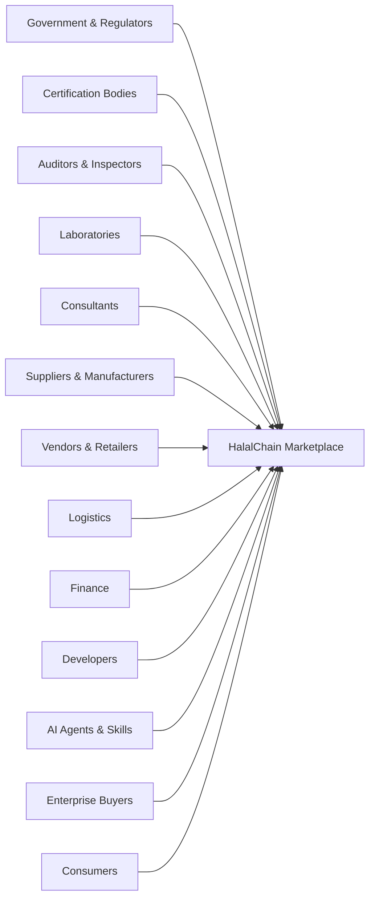

---

# 2. What Is HalalChain Marketplace?

HalalChain Marketplace is a **multi-participant trust and transaction infrastructure platform**.

It combines:

1. participant identity
2. organizational profiles
3. delegated authority
4. capability declarations
5. evidence management
6. certification workflows
7. compliance evaluation
8. API integrations
9. MCP tools
10. AI agents
11. skills
12. logistics
13. fintech
14. blockchain anchoring
15. audit trails
16. tenant isolation
17. governance
18. marketplace discovery

The marketplace is therefore not simply:

> Vendor → Product → Customer

Instead, it becomes:

> Participant → Capability → Evidence → Workflow → Verification → Decision → Transaction

---

# 3. The Core Problem

The halal ecosystem contains many independent organizations.

A manufacturer may work with:

* multiple ingredient suppliers
* multiple laboratories
* multiple auditors
* one or more certification bodies
* logistics providers
* customs authorities
* banks
* marketplaces
* enterprise buyers
* government registries

Each organization may have its own:

* database
* API
* certificate system
* identity system
* workflow
* document format
* evidence model
* compliance terminology

The result can be fragmented trust.

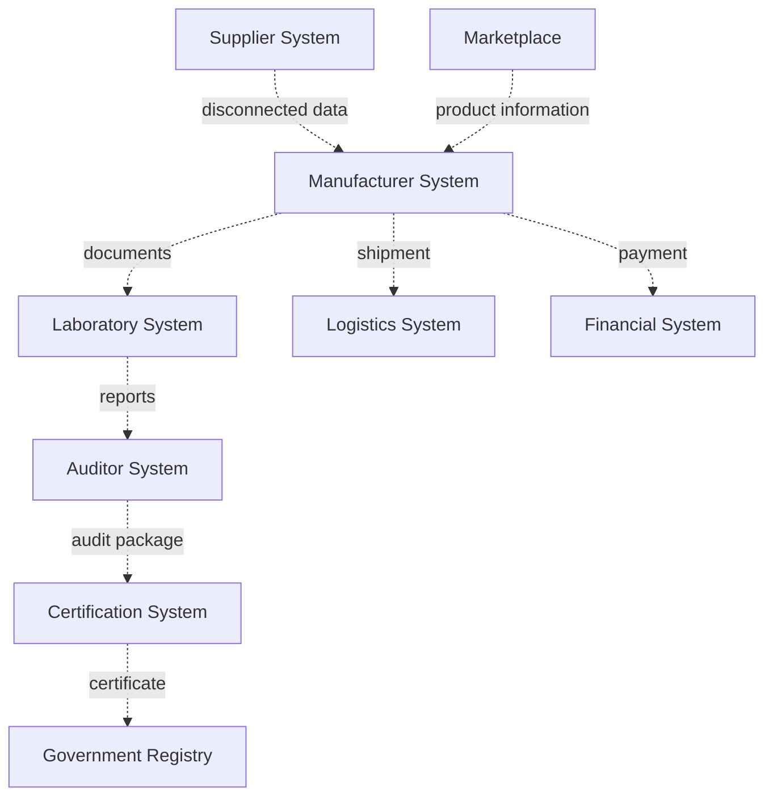

HalalChain provides a common infrastructure layer without requiring every participant to replace its existing system.

---

# 4. The HalalChain Model

HalalChain is based on six fundamental layers:

```text
Marketplace
     ↓
Participant
     ↓
Integration
     ↓
Workflow
     ↓
Evidence
     ↓
Deterministic Compliance
     ↓
Trust / Provenance
```

More explicitly:

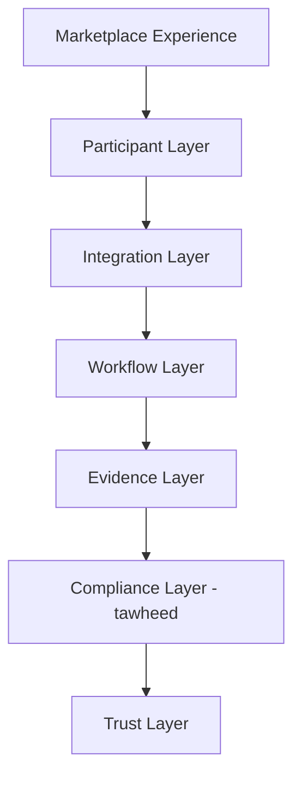

The important boundary is between **evidence collection** and **compliance decisioning**.

---

# 5. Core Principle

## AI gathers evidence. Deterministic systems decide.

This principle governs the entire platform.

AI may:

* read documents
* extract certificate fields
* classify ingredients
* identify missing evidence
* summarize audits
* compare documents
* monitor expiry
* detect anomalies
* call external systems
* propose evidence
* prepare audit packages
* recommend next actions

AI may not:

* independently issue an authoritative halal verdict
* bypass authorization
* mutate authoritative compliance state
* impersonate a certification authority
* approve a certificate without the applicable authority
* override `tawheed`
* silently change tenant boundaries

The architecture is therefore:

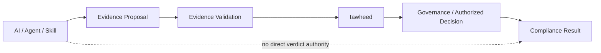

---

# 6. Ecosystem Participants

HalalChain is designed to support a broad participant ecosystem.

## 6.1 Government

* Government halal agencies
* Food regulators
* Health regulators
* Trade regulators
* Agriculture authorities
* Customs authorities
* Border authorities
* Import/export authorities
* Consumer protection authorities
* Product safety authorities

## 6.2 Accreditation and Standards

* Accreditation bodies
* Standards organizations
* International standards organizations
* Industry associations
* Trade associations

## 6.3 Halal Assurance

* Halal certification bodies
* Auditors
* Inspection companies
* Laboratories
* Shariah advisory boards
* Shariah scholars
* Halal consultants
* Certification consultants

## 6.4 Commerce

* Ingredient suppliers
* Raw-material suppliers
* Manufacturers
* Contract manufacturers
* Distributors
* Importers
* Exporters
* Wholesalers
* Retailers
* Marketplaces
* Vendors

## 6.5 Logistics

* Carriers
* Freight forwarders
* Warehouses
* Cold-chain providers
* Ports
* Free zones
* Customs brokers
* Last-mile delivery providers
* Fulfillment providers

## 6.6 Finance

* Islamic banks
* Conventional banks
* Fintech companies
* Payment providers
* Escrow providers
* Takaful providers
* Zakat institutions
* Waqf institutions
* Sadaqah organizations
* Treasury providers

## 6.7 Technology

* Developers
* SaaS providers
* ERP vendors
* POS vendors
* IoT vendors
* Certification software
* Supply-chain software
* API providers
* Integration providers
* Data providers

## 6.8 AI

* AI agent developers
* Skill developers
* MCP developers
* Workflow providers
* AI service providers
* Enterprise AI teams

## 6.9 Research and Civil Society

* Universities
* Researchers
* NGOs
* Foundations
* Industry research organizations

## 6.10 Buyers and Consumers

* Enterprise buyers
* Procurement organizations
* Governments
* Hospitality groups
* Food-service organizations
* Consumers

---

# 7. Participant Taxonomy

Participants should not be treated as one undifferentiated category.

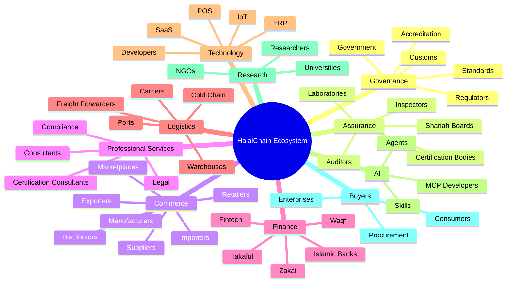

Participant type determines available capabilities, workflows, credentials, and governance requirements.

---

# 8. Ecosystem Architecture

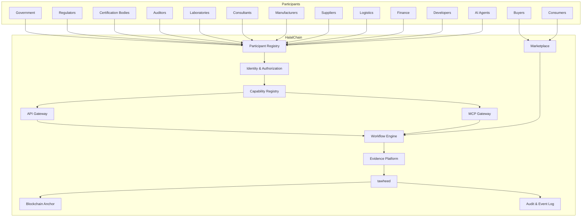

---

# 9. Participant Registry

The **Participant Registry** is foundational infrastructure.

Every participant should have a canonical platform identity.

Core concepts include:

* `Participant`
* `Organization`
* `ParticipantType`
* `Role`
* `Credential`
* `Capability`
* `DelegatedAuthority`

A participant can be:

* an organization
* an individual professional
* a government entity
* a technology provider
* an AI agent
* a registered service provider

A participant can have multiple roles.

For example:

```text
Organization
 ├── Manufacturer
 ├── Importer
 ├── Vendor
 └── Exporter
```

Another organization may be:

```text
Certification Organization
 ├── Certification Body
 ├── Auditor
 └── Inspection Provider
```

Participant identity must remain separate from capability.

Being registered does not automatically grant authority.

---

# 10. Multi-Tenancy

Tenant isolation is mandatory.

Every tenant-owned resource must be scoped to the correct tenant.

Examples:

* products
* certificates
* evidence
* API keys
* agent profiles
* skills
* shipments
* fintech arrangements
* BYOK credentials
* webhooks
* audit records

Conceptually:

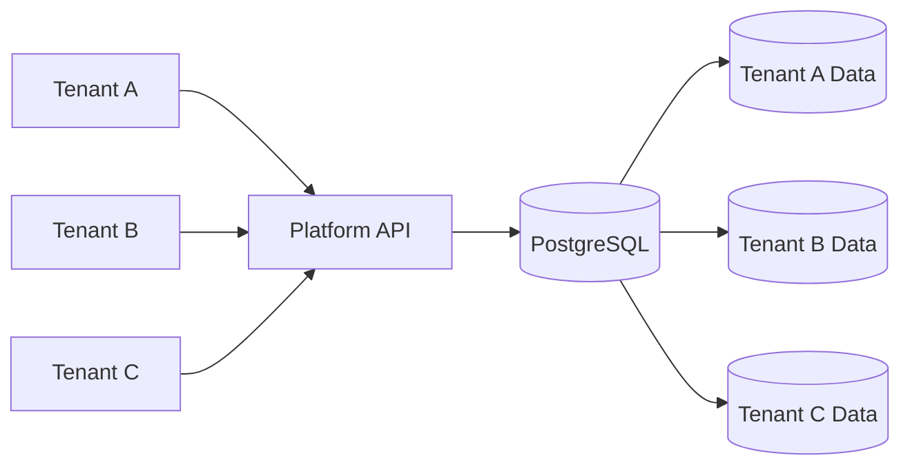

No request should be able to access another tenant's resources merely by changing an identifier.

Tenant boundaries must be enforced through:

* authentication
* authorization
* service-layer checks
* database constraints
* query filters where appropriate
* architecture tests
* integration tests

---

# 11. Identity, Roles and Delegated Authority

Identity answers:

> Who are you?

Role answers:

> What role are you operating under?

Capability answers:

> What can you technically do?

Delegated authority answers:

> What are you authorized to do on behalf of another participant?

These concepts must not be collapsed.

## Example

A halal consultant may receive delegated authority from a manufacturer to:

* prepare an application
* collect certificates
* request laboratory evidence
* coordinate an audit
* monitor corrective actions
* prepare an evidence package

The consultant does not automatically receive authority to:

* issue a halal certificate
* approve the manufacturer's halal status
* override a certification body
* modify authoritative compliance decisions

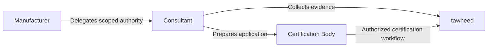

Delegated authority must be:

* explicit
* scoped
* time-limited where appropriate
* revocable
* auditable
* tenant-aware

---

# 12. Capability Model

Participants declare capabilities.

Examples:

```text
certificate.issue
certificate.verify
audit.perform
inspection.perform
laboratory.test
shipment.create
shipment.track
payment.create
escrow.create
skill.publish
agent.execute
evidence.propose
evidence.read
mcp.execute
```

Capabilities are not inferred merely from participant type.

For example:

```text
ParticipantType = LogisticsProvider
```

does not automatically mean:

```text
shipment.customs.submit
```

The capability must be explicitly declared, approved where required, and enforced.

---

# 13. Evidence Infrastructure

Evidence is a first-class platform concept.

Examples:

* halal certificates
* laboratory reports
* supplier declarations
* ingredient specifications
* audit reports
* inspection reports
* production records
* slaughter records
* batch records
* customs declarations
* delivery confirmations
* cold-chain logs
* blockchain anchors
* regulatory registrations
* accreditation records
* Shariah opinions
* financial certification
* insurance/takaful evidence

Evidence should contain provenance.

Conceptually:

```text
Evidence
 ├── Id
 ├── TenantId
 ├── Type
 ├── SourceParticipantId
 ├── SubjectId
 ├── IssuedAt
 ├── ExpiresAt
 ├── ContentReference
 ├── Hash
 ├── Provenance
 ├── VerificationStatus
 ├── BlockchainAnchor
 └── CreatedAt
```

---

# 14. Evidence Chain

HalalChain connects evidence across the supply chain.

Example:

```mermaid
flowchart LR
    ING[Ingredient]
    SUP[Supplier]
    CERT1[Supplier Certificate]
    LAB[Laboratory Report]
    MAN[Manufacturer]
    AUD[Manufacturing Audit]
    BATCH[Production Batch]
    HCERT[Halal Certificate]
    SHIP[Shipment]
    DELIVERY[Delivery Confirmation]
    MARKET[Marketplace]

    ING --> SUP
    SUP --> CERT1
    CERT1 --> LAB
    LAB --> MAN
    MAN --> AUD
    AUD --> BATCH
    BATCH --> HCERT
    HCERT --> SHIP
    SHIP --> DELIVERY
    DELIVERY --> MARKET
```

This creates a traceable chain from source material to consumer-facing information.

---

# 15. Compliance Architecture

The compliance architecture has a clear boundary.

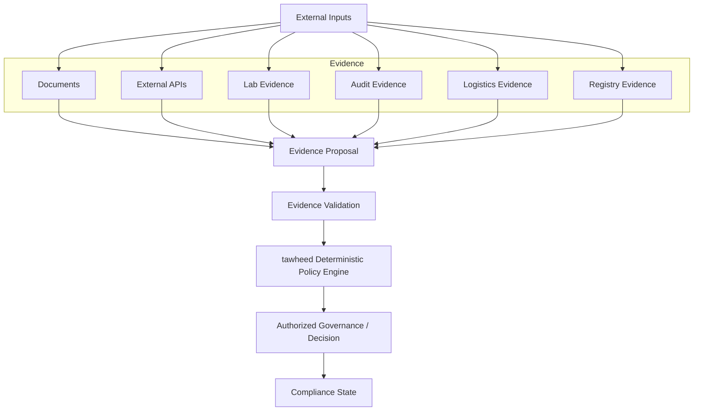

External participants contribute evidence and capabilities.

The authoritative decision boundary remains protected.

---

# 16. AI and Agent Architecture

AI agents are first-class participants but remain constrained by the same platform governance model.

Agents can:

* call APIs
* call MCP tools
* execute skills
* read authorized evidence
* propose evidence
* perform document extraction
* perform analysis
* monitor workflows
* generate reports
* detect missing information
* notify participants

Agents cannot bypass:

* authentication
* authorization
* tenant boundaries
* capability checks
* evidence boundaries
* `tawheed`
* governance
* budget limits

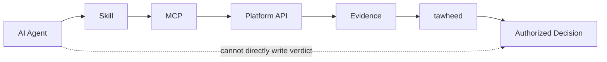

---

# 17. Skills Marketplace

Skills are reusable AI/workflow capabilities.

A skill may provide:

* document verification
* certificate extraction
* blockchain verification
* supplier discovery
* laboratory report analysis
* shipment tracking
* customs document preparation
* audit package preparation
* compliance evidence collection

Skills are governed artifacts.

Example manifest:

```yaml
---
name: halal-certificate-verifier
version: 1.0.0
description: Verify a halal certificate using issuer registry and blockchain evidence
author: HalalChain
license: Apache-2.0
tools:
  - http
  - blob-read
  - chain-read
emits:
  - EvidenceProposal
---
```

A skill must declare:

* identity
* version
* author
* tools
* capabilities
* outputs
* budget
* dependencies
* permissions

Skills cannot secretly obtain additional capabilities.

---

# 18. MCP Platform

HalalChain exposes MCP capabilities through a controlled MCP gateway.

Example endpoint:

```text
/mcp
```

MCP access requires:

* authentication
* tenant context
* API key or approved credential
* scope validation
* capability validation
* rate limiting
* audit logging
* tracing without secrets

## Read-only tools

Examples:

```text
vendor.compliance.get
vendor.evidence.summary
certificate.verify
blockchain.anchor.verify
skill.list
skill.get
```

## Evidence tools

```text
evidence.propose
evidence.read
```

## Policy evaluation

```text
tawheed.evaluate
```

## Forbidden capabilities

The MCP layer must not expose generic tools such as:

```text
verdict.write
compliance.verdict.set
certificate.approve
certificate.reject
```

unless the capability is part of a specifically authorized governance workflow and is implemented through the correct authoritative boundary.

---

# 19. Developer Platform

Developers are ecosystem participants.

The developer platform provides:

* API keys
* agent profiles
* API explorer
* sandbox
* MCP access
* webhooks
* skill publishing
* skill installation
* usage metrics
* integration documentation

Suggested Blazor structure:

```text
Features/DeveloperPortal/
├── Dashboard/
│   ├── DeveloperDashboardPage.razor
│   └── Components/
│       ├── ApiKeyManager.razor
│       ├── UsageMetrics.razor
│       └── AgentProfileEditor.razor
├── ApiExplorer/
│   ├── ApiExplorerPage.razor
│   └── Components/
│       ├── EndpointTester.razor
│       └── McpToolInspector.razor
├── Sandbox/
│   ├── SandboxPage.razor
│   └── Components/
│       └── SandboxDataBrowser.razor
├── Skills/
│   ├── SkillsPage.razor
│   └── Components/
│       ├── SkillCard.razor
│       ├── SkillInstaller.razor
│       └── SkillPublisher.razor
└── Webhooks/
    ├── WebhookPage.razor
    └── Components/
        └── WebhookTester.razor
```

---

# 20. BYOK

BYOK means **Bring Your Own Key**.

HalalChain supports tenant-owned credentials where appropriate.

Potential credentials include:

* LLM provider keys
* blockchain RPC keys
* cloud credentials
* blob-storage credentials
* external API keys
* KMS credentials
* enterprise integration credentials

## Secret lifecycle

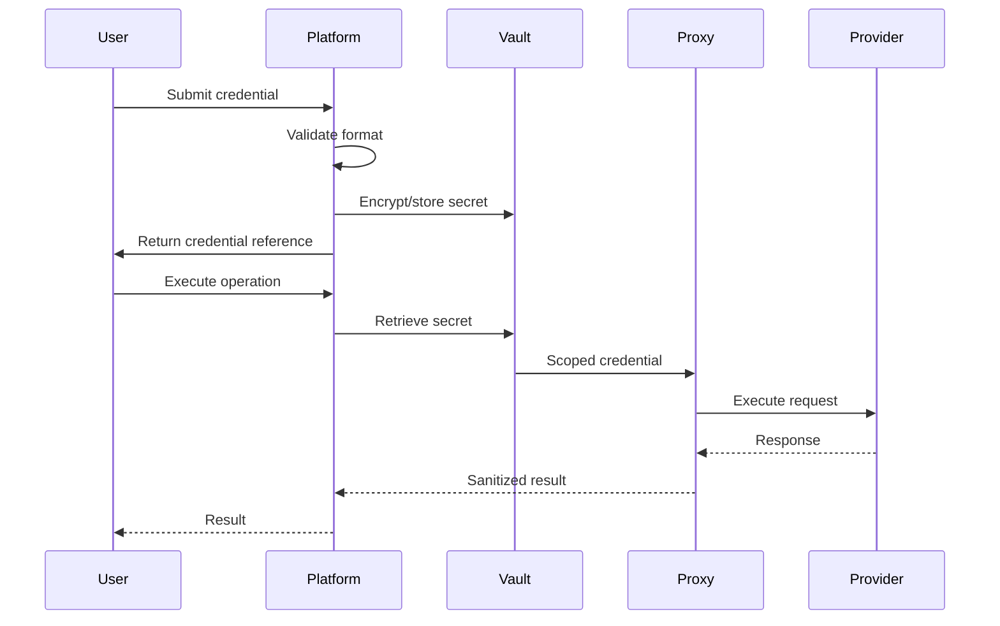

Plaintext secrets must never be:

* logged
* traced
* stored in PostgreSQL
* returned after creation
* written to workflow state
* included in exception messages
* included in telemetry
* included in audit records

---

# 21. Data Residency

BYOK and external provider execution must respect data residency policies.

The platform should evaluate:

```text
Tenant Region
+
Provider Region
+
Allowed Processing Regions
+
Tenant Policy
+
Data Classification
```

before execution.

If execution is not permitted:

```text
ExecutionDeniedByDataResidencyPolicy
```

The platform must not silently reroute the request to another region.

---

# 22. Certification Bodies

Certification bodies are specialized authoritative participants.

They may:

* manage certification schemes
* receive applications
* request evidence
* assign auditors
* review evidence
* issue certificates
* suspend certificates
* renew certificates
* maintain certificate registries

Certification information should distinguish:

```text
Provider Claim
```

from:

```text
Authorized Registry Evidence
```

For example:

> A company says that certificate `ABC-123` is valid.

is different from:

> An authorized certification registry confirms that certificate `ABC-123` exists, is active, and applies to the specified scope.

The provenance of each claim must remain visible.

---

# 23. Auditors and Inspection Companies

Auditors and inspectors provide assurance evidence.

Capabilities may include:

```text
audit.schedule
audit.perform
audit.report.submit
inspection.schedule
inspection.perform
inspection.report.submit
corrective-action.request
corrective-action.verify
```

Audit evidence can contain:

* auditor identity
* organization
* accreditation
* scope
* facility
* audit date
* findings
* corrective actions
* attachments
* signatures
* verification status

---

# 24. Laboratories

Laboratories can provide analytical evidence.

Examples:

* DNA testing
* alcohol analysis
* contamination testing
* ingredient verification
* microbiological testing
* chemical analysis
* authenticity testing

A laboratory result should preserve:

```text
Laboratory
Method
Sample
Collection Date
Test Date
Result
Unit
Reference Range
Report
Signature
Accreditation
Chain of Custody
```

The laboratory provides evidence.

The compliance engine determines how that evidence is interpreted under the applicable policy.

---

# 25. Consultants and Professional Services

Consultants are represented as delegated operators.

Typical capabilities:

* certification preparation
* evidence collection
* application preparation
* audit coordination
* corrective-action management
* expiry monitoring
* supplier documentation
* compliance package preparation

Consultants do not automatically receive authoritative compliance authority.

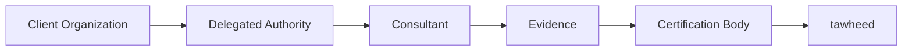

Authority should be:

* scoped
* explicit
* revocable
* time-bound where appropriate
* auditable

---

# 26. Government and Regulatory Integration

Government participants require a different trust model from commercial providers.

Potential integrations include:

* halal registries
* food registries
* company registries
* import/export registries
* customs systems
* product registries
* regulatory databases
* accreditation registries

Government data may be consumed through:

* API
* registry synchronization
* signed documents
* verified datasets
* webhooks
* secure data exchange

The system should distinguish:

```text
Commercial Provider Evidence
```

from:

```text
Government / Authorized Registry Evidence
```

This distinction is critical for provenance.

---

# 27. Manufacturers and Supply Chain

Manufacturers can connect:

* suppliers
* ingredients
* facilities
* production lines
* batches
* certificates
* audits
* laboratories
* logistics

A simplified manufacturing evidence graph:

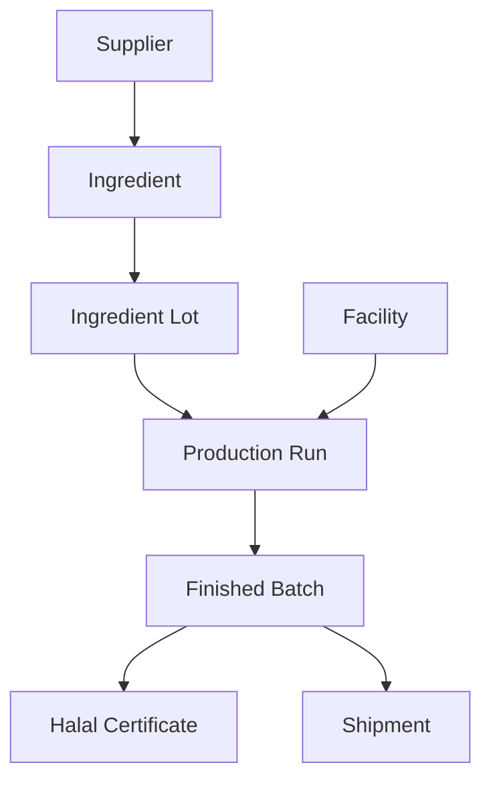

This provides traceability across the product lifecycle.

---

# 28. Logistics Marketplace

Logistics providers are integrated through provider-neutral interfaces.

Core concepts:

* `LogisticsProvider`
* `LogisticsProviderCapability`
* `CarrierServiceLevel`
* `Shipment`
* `ShipmentItem`
* `ShipmentCredential`
* `TrackingEvent`
* `DeliveryConfirmation`
* `ReturnShipment`

Provider interface:

```csharp
public interface ILogisticsProvider
{
    Task<ShipmentQuote> QuoteAsync(
        QuoteRequest request,
        CancellationToken cancellationToken);

    Task<Shipment> CreateShipmentAsync(
        ShipmentRequest request,
        CancellationToken cancellationToken);

    Task<Label> GenerateLabelAsync(
        ShipmentId shipmentId,
        CancellationToken cancellationToken);

    Task<TrackingUpdate> GetTrackingAsync(
        ShipmentId shipmentId,
        CancellationToken cancellationToken);

    Task<ReturnLabel> CreateReturnAsync(
        ReturnRequest request,
        CancellationToken cancellationToken);
}
```

Logistics evidence may include:

```text
DeliveryConfirmation
CustomsDeclaration
ColdChainLog
```

---

# 29. Logistics Flow

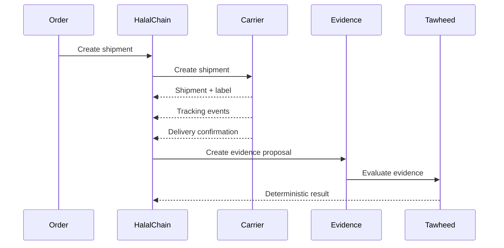

A carrier must never directly mutate authoritative compliance state.

---

# 30. Fintech and Islamic Finance

Fintech participants may provide:

* payments
* escrow
* split settlement
* treasury
* payouts
* financing integrations
* zakat processing
* sadaqah processing
* waqf flows

Potential concepts:

```text
FintechProvider
FintechCapability
FintechCertification
EscrowArrangement
WakalaAgreement
PayoutInstruction
ProviderCertificationReview
```

For Islamic-finance providers, applicable Shariah certification and governance evidence should be represented explicitly.

---

# 31. Fintech Architecture

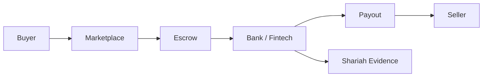

Finance infrastructure must remain separate from compliance decisioning while exposing the required evidence and authorization boundaries.

---

# 32. Procurement and Enterprise Buyers

Enterprise buyers may need to evaluate suppliers using:

* certification status
* evidence completeness
* accreditation
* audit status
* product scope
* jurisdiction
* logistics capabilities
* financial terms
* delivery performance
* evidence freshness

The marketplace can expose machine-readable procurement data.

Example:

```text
Supplier
 ├── Products
 ├── Certificates
 ├── Evidence
 ├── Audits
 ├── Facilities
 ├── Logistics
 ├── Regulatory Registrations
 └── Compliance State
```

---

# 33. Consumer Marketplace

Consumers can interact with verified marketplace information.

A product page may display:

* product information
* manufacturer
* supplier
* halal certificate
* certification body
* certificate scope
* certificate status
* evidence freshness
* applicable jurisdiction
* product provenance
* logistics information

Consumers should receive understandable information without exposing sensitive internal evidence.

---

# 34. Blockchain and Trust

Blockchain is used for **integrity and provenance**, not as the authority itself.

A blockchain anchor can establish:

```text
Evidence Hash
+
Timestamp
+
Anchor Transaction
+
Network
```

It does not automatically establish:

```text
Halal
Not Halal
Certified
Not Certified
```

Those decisions remain governed by the applicable policy, evidence, authority, and governance process.

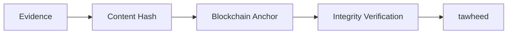

---

# 35. Security Architecture

Security is a platform-level requirement.

Critical security risks include:

* credential leakage
* API-key leakage
* tenant data leakage
* webhook forgery
* webhook replay
* capability escalation
* SSRF
* malicious skills
* unauthorized evidence access
* agent privilege escalation
* compliance bypass

SEV1 examples:

```text
BYOK credential leakage
API key leakage
Cross-tenant access
Unsigned webhook acceptance
Payment webhook replay
Skill capability escalation
Agent bypassing tawheed
Unauthorized compliance mutation
```

Controls include:

* authentication
* authorization
* tenant isolation
* scoped credentials
* secret vaulting
* rate limiting
* webhook signatures
* replay protection
* idempotency
* SSRF protection
* input validation
* audit logging
* security scanning
* capability enforcement

---

# 36. Webhooks and Event Architecture

External webhooks must be treated as untrusted input.

Requirements:

* signature validation
* timestamp validation
* replay protection
* event ID
* idempotency
* tenant binding
* provider binding
* audit logging
* normalized internal event

Example logistics events:

```text
shipment.created
shipment.updated
shipment.in_transit
shipment.out_for_delivery
shipment.delivered
shipment.failed
shipment.returned
```

Example:

```mermaid
flowchart LR
    PROVIDER[External Provider]
    WEBHOOK[Webhook Endpoint]
    VERIFY[Signature Verification]
    REPLAY[Replay Protection]
    NORMALIZE[Event Normalization]
    EVENT[Internal Event]
    WORKFLOW[Workflow]
    EVIDENCE[Evidence]

    PROVIDER --> WEBHOOK
    WEBHOOK --> VERIFY
    VERIFY --> REPLAY
    REPLAY --> NORMALIZE
    NORMALIZE --> EVENT
    EVENT --> WORKFLOW
    WORKFLOW --> EVIDENCE
```

---

# 37. API Architecture

API design should remain provider-neutral.

Recommended namespace:

```text
/api/v1/
```

Examples:

```text
/api/v1/participants
/api/v1/developers
/api/v1/skills
/api/v1/logistics
/api/v1/fintech
/api/v1/evidence
/api/v1/certifications
/api/v1/audits
/api/v1/laboratories
/api/v1/byok
/api/v1/webhooks
```

Actual routing must follow repository conventions.

---

# 38. Database Architecture

PostgreSQL is the primary transactional database.

Suggested tables include:

## Ecosystem

```text
participants
organizations
participant_types
participant_roles
participant_credentials
participant_capabilities
delegated_authorities
```

## Developer Platform

```text
agent_profiles
agent_api_keys
developer_webhooks
```

## Skills

```text
skills
skill_versions
skill_tools
skill_installations
skill_governance_reviews
skill_security_findings
```

## Evidence

```text
evidence
evidence_sources
evidence_proposals
evidence_verifications
evidence_relationships
```

## Certification

```text
certification_bodies
certifications
certificate_scopes
certificate_verifications
```

## Auditing

```text
audits
audit_findings
corrective_actions
inspections
inspection_reports
```

## Laboratory

```text
laboratories
lab_tests
lab_samples
lab_reports
```

## Logistics

```text
logistics_providers
logistics_service_levels
shipments
shipment_items
shipment_credentials
tracking_events
delivery_confirmations
return_shipments
```

## Finance

```text
fintech_providers
fintech_capabilities
fintech_certifications
escrow_arrangements
wakala_agreements
payout_instructions
```

## BYOK

```text
byok_credentials
byok_provider_configs
```

## Infrastructure

```text
provider_webhooks
audit_events
outbox_messages
```

Indexes should cover:

* tenant
* participant
* status
* provider
* certificate
* skill slug/version
* developer
* shipment
* tracking event
* webhook event ID
* API key fingerprint

---

# 39. Repository Structure

A suggested high-level repository layout:

```text
src/
├── HalalChain.Platform.Api/
├── HalalChain.Platform.Application/
├── HalalChain.Platform.Domain/
├── HalalChain.Platform.Infrastructure/
├── HalalChain.Mcp/
├── HalalChain.Web/
├── HalalChain.Agent/
├── HalalChain.Tawheed/
└── HalalChain.Shared/

tests/
├── HalalChain.Architecture.Tests/
├── HalalChain.UnitTests/
├── HalalChain.IntegrationTests/
├── HalalChain.Api.Tests/
└── HalalChain.E2E.Tests/

docs/
├── ARCHITECTURE.md
├── SECURITY.md
├── GOVERNANCE.md
├── API.md
└── ADR/

skills/
├── halal-certificate-verifier/
├── evidence-collector/
└── ...

.cline_inbox/
├── PRINCIPLES.md
└── manifests/
    └── controls.yaml
```

The actual repository should remain authoritative.

New code must first inspect existing architecture before introducing duplicate abstractions.

---

# 40. Technology Stack

Core technology:

| Area             | Technology                              |
| ---------------- | --------------------------------------- |
| Runtime          | .NET 10                                 |
| Backend          | ASP.NET Core                            |
| UI               | Blazor                                  |
| Database         | PostgreSQL                              |
| ORM              | Entity Framework Core                   |
| API              | REST / JSON                             |
| AI Integration   | Agent Runtime                           |
| Tool Integration | MCP                                     |
| Compliance       | `tawheed`                               |
| Evidence         | Evidence Store                          |
| Integrity        | Blockchain Anchoring                    |
| Authentication   | Existing Platform Identity              |
| Secrets          | Secure Secret Vault                     |
| Testing          | Unit / Integration / Architecture / E2E |

Existing project conventions take precedence over this table.

---

# 41. Architecture Diagram

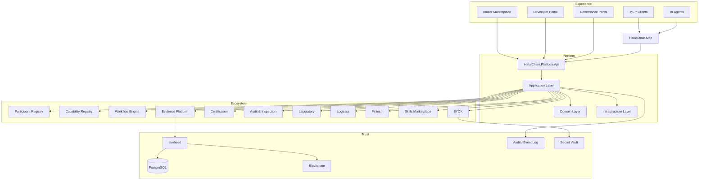

---

# 42. End-to-End Evidence Flow

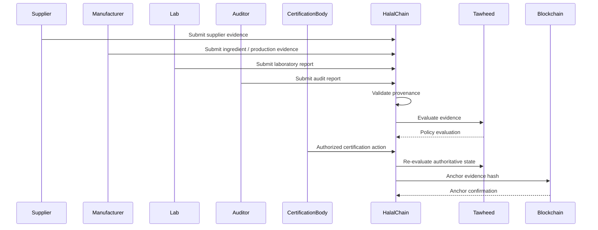

---

# 43. Compliance Decision Flow

```mermaid
flowchart TD
    START[Evidence Received]
    AUTH[Authenticate Source]
    CAP[Check Capability]
    TENANT[Check Tenant Boundary]
    PROV[Validate Provenance]
    FRESH[Check Freshness / Expiry]
    SCHEMA[Validate Evidence Schema]
    POLICY[tawheed Policy Evaluation]
    GOVERN[Applicable Governance]
    STATE[Compliance State]
    AUDIT[Audit Event]

    START --> AUTH
    AUTH --> CAP
    CAP --> TENANT
    TENANT --> PROV
    PROV --> FRESH
    FRESH --> SCHEMA
    SCHEMA --> POLICY
    POLICY --> GOVERN
    GOVERN --> STATE
    STATE --> AUDIT
```

Any failed security or authorization check should stop the flow rather than silently continuing.

---

# 44. Participant Interaction Flow

```mermaid
flowchart LR
    REGISTER[Register Participant]
    VERIFY[Verify Identity]
    ROLE[Assign Roles]
    CAP[Declare Capabilities]
    CRED[Issue Credentials]
    AUTH[Grant Authority]
    INTEGRATE[Connect API/MCP]
    OPERATE[Participate]
    AUDIT[Audit Activity]

    REGISTER --> VERIFY
    VERIFY --> ROLE
    ROLE --> CAP
    CAP --> CRED
    CRED --> AUTH
    AUTH --> INTEGRATE
    INTEGRATE --> OPERATE
    OPERATE --> AUDIT
```

---

# 45. Developer and Agent Flow

```mermaid
flowchart TD
    DEV[Developer]
    PROFILE[Developer Profile]
    AGENT[Agent Profile]
    KEY[API Key]
    SCOPE[Scopes]
    SKILL[Skill]
    MCP[MCP]
    SANDBOX[Sandbox]
    API[Platform API]
    EVIDENCE[Evidence]
    TAW[tawheed]

    DEV --> PROFILE
    PROFILE --> AGENT
    AGENT --> KEY
    KEY --> SCOPE

    DEV --> SKILL
    SKILL --> MCP
    AGENT --> MCP
    MCP --> SANDBOX
    MCP --> API
    API --> EVIDENCE
    EVIDENCE --> TAW
```

---

# 46. Logistics Flow

```mermaid
flowchart TD
    ORDER[Order]
    QUOTE[Shipping Quote]
    SHIPMENT[Shipment]
    LABEL[Label]
    TRACK[Tracking]
    CUSTOMS[Customs]
    DELIVERY[Delivery]
    EVIDENCE[Delivery Evidence]
    TAW[tawheed]

    ORDER --> QUOTE
    QUOTE --> SHIPMENT
    SHIPMENT --> LABEL
    SHIPMENT --> TRACK
    TRACK --> CUSTOMS
    CUSTOMS --> DELIVERY
    DELIVERY --> EVIDENCE
    EVIDENCE --> TAW
```

---

# 47. Fintech Flow

```mermaid
flowchart TD
    ORDER[Marketplace Order]
    PAYMENT[Payment]
    ESCROW[Escrow]
    HOLD[Funds Held]
    CONDITIONS[Release Conditions]
    PAYOUT[Payout]
    RECON[Reconciliation]
    AUDIT[Financial Audit]

    ORDER --> PAYMENT
    PAYMENT --> ESCROW
    ESCROW --> HOLD
    HOLD --> CONDITIONS
    CONDITIONS --> PAYOUT
    PAYOUT --> RECON
    RECON --> AUDIT
```

---

# 48. Certification Workflow

```mermaid
stateDiagram-v2
    [*] --> Draft
    Draft --> ApplicationSubmitted
    ApplicationSubmitted --> EvidenceCollection
    EvidenceCollection --> AuditScheduled
    AuditScheduled --> AuditCompleted
    AuditCompleted --> CorrectiveAction
    CorrectiveAction --> EvidenceReview
    CorrectiveAction --> EvidenceCollection
    EvidenceReview --> GovernanceReview
    GovernanceReview --> Certified
    GovernanceReview --> Rejected
    Certified --> Suspended
    Certified --> Expired
    Suspended --> EvidenceReview
    Suspended --> Certified
    Certified --> Renewed
    Renewed --> Certified
```

The exact certification lifecycle should be configurable by certification scheme and jurisdiction.

---

# 49. Skill Governance Workflow

```mermaid
stateDiagram-v2
    [*] --> Draft
    Draft --> Submitted
    Submitted --> SecurityReview
    SecurityReview --> GovernanceReview
    SecurityReview --> Rejected
    GovernanceReview --> Published
    GovernanceReview --> Rejected
    Published --> Suspended
    Suspended --> Published
    Published --> Deprecated
```

Governance checks should include:

1. manifest validation
2. schema validation
3. declared-tool validation
4. capability validation
5. budget validation
6. static security analysis
7. no-verdict scan
8. developer verification
9. governance review

Reject or suspend a skill when it:

* attempts to issue unauthorized verdicts
* uses undeclared tools
* requests unauthorized capabilities
* has unbounded execution
* contains malicious behavior
* violates tenant boundaries
* bypasses platform controls

---

# 50. BYOK Execution Flow

```mermaid
flowchart TD
    USER[User / Tenant]
    SUBMIT[Credential Submission]
    VALIDATE[Format Validation]
    VAULT[Secret Vault]
    POLICY[Region / Policy Check]
    BUDGET[Budget Check]
    PROXY[Execution Proxy]
    PROVIDER[External Provider]
    METER[Usage Metering]
    RESULT[Sanitized Result]

    USER --> SUBMIT
    SUBMIT --> VALIDATE
    VALIDATE --> VAULT

    USER --> POLICY
    POLICY --> BUDGET
    BUDGET --> PROXY
    VAULT --> PROXY
    PROXY --> PROVIDER
    PROVIDER --> METER
    METER --> RESULT
```

---

# 51. API Surface

## Participants

```http
GET    /api/v1/participants
POST   /api/v1/participants
GET    /api/v1/participants/{id}
PATCH  /api/v1/participants/{id}
```

## Developers

```http
POST   /api/v1/developers/agents
GET    /api/v1/developers/agents
GET    /api/v1/developers/agents/{id}
PATCH  /api/v1/developers/agents/{id}
```

## API Keys

```http
POST   /api/v1/developers/api-keys
POST   /api/v1/developers/api-keys/{id}/rotate
POST   /api/v1/developers/api-keys/{id}/revoke
```

## Skills

```http
GET    /api/v1/skills
POST   /api/v1/skills
GET    /api/v1/skills/{id}
GET    /api/v1/skills/{id}/versions
POST   /api/v1/skills/{id}/versions
POST   /api/v1/skills/{id}/submit
POST   /api/v1/skills/{id}/publish
POST   /api/v1/skills/{id}/install
DELETE /api/v1/skills/{id}/install
```

## Logistics

```http
GET    /api/v1/logistics/providers
POST   /api/v1/logistics/providers
GET    /api/v1/logistics/providers/{id}

POST   /api/v1/logistics/shipments/quote
POST   /api/v1/logistics/shipments
GET    /api/v1/logistics/shipments/{id}
GET    /api/v1/logistics/shipments/{id}/tracking
POST   /api/v1/logistics/returns
```

## Fintech

```http
GET    /api/v1/fintech/providers
POST   /api/v1/fintech/providers
GET    /api/v1/fintech/providers/{id}
GET    /api/v1/fintech/providers/{id}/certification

POST   /api/v1/fintech/escrows
GET    /api/v1/fintech/escrows/{id}
POST   /api/v1/fintech/payouts
```

## Evidence

```http
GET    /api/v1/evidence
GET    /api/v1/evidence/{id}
POST   /api/v1/evidence/proposals
GET    /api/v1/evidence/{id}/verification
```

## BYOK

```http
GET    /api/v1/byok/providers
POST   /api/v1/byok/credentials
GET    /api/v1/byok/credentials
POST   /api/v1/byok/credentials/{id}/rotate
POST   /api/v1/byok/credentials/{id}/revoke
```

Actual API routes must follow existing repository conventions.

---

# 52. Core Domain Model

The platform should model the ecosystem as connected aggregates.

```mermaid
erDiagram

    PARTICIPANT ||--o{ PARTICIPANT_ROLE : has
    PARTICIPANT ||--o{ PARTICIPANT_CAPABILITY : declares
    PARTICIPANT ||--o{ CREDENTIAL : owns
    PARTICIPANT ||--o{ DELEGATED_AUTHORITY : grants
    PARTICIPANT ||--o{ EVIDENCE : produces

    PARTICIPANT ||--o{ AGENT_PROFILE : owns
    AGENT_PROFILE ||--o{ AGENT_API_KEY : has

    PARTICIPANT ||--o{ SKILL : publishes
    SKILL ||--o{ SKILL_VERSION : has
    SKILL_VERSION ||--o{ SKILL_TOOL : declares
    SKILL ||--o{ SKILL_INSTALLATION : installed_as

    PARTICIPANT ||--o{ CERTIFICATION : receives
    CERTIFICATION ||--o{ CERTIFICATE_SCOPE : covers

    PARTICIPANT ||--o{ AUDIT : subject
    AUDIT ||--o{ AUDIT_FINDING : contains
    AUDIT_FINDING ||--o{ CORRECTIVE_ACTION : requires

    PARTICIPANT ||--o{ SHIPMENT : owns
    SHIPMENT ||--o{ SHIPMENT_ITEM : contains
    SHIPMENT ||--o{ TRACKING_EVENT : produces
    SHIPMENT ||--o{ DELIVERY_CONFIRMATION : confirms

    PARTICIPANT ||--o{ FINTECH_PROVIDER : operates
    FINTECH_PROVIDER ||--o{ FINTECH_CAPABILITY : supports
    FINTECH_PROVIDER ||--o{ FINTECH_CERTIFICATION : has

    PARTICIPANT ||--o{ BYOK_CREDENTIAL : owns
```

---

# 53. Governance Model

Governance must exist independently of technology.

Different participants have different authority.

For example:

```text
Developer
    → Technology capability

Laboratory
    → Analytical evidence

Auditor
    → Audit evidence

Certification Body
    → Certification authority

Government Registry
    → Regulatory / registry evidence

Consultant
    → Delegated operational authority

AI Agent
    → Automated execution within granted capabilities
```

No participant should receive authority simply because it can technically call an API.

---

# 54. Security Requirements

## Mandatory controls

### Authentication

Every privileged operation must require authenticated identity.

### Authorization

Every operation must validate:

* tenant
* participant
* role
* capability
* scope
* delegated authority where applicable

### Secrets

Never log:

* passwords
* API keys
* BYOK credentials
* access tokens
* refresh tokens
* private keys

### Webhooks

Every external webhook should support:

* signature validation
* timestamp checks
* replay protection
* idempotency

### SSRF

External URL access must use:

* allowlists where appropriate
* protocol restrictions
* DNS/IP validation
* private-network blocking
* redirect validation

### Skill Security

Published skills require:

* manifest validation
* static scanning
* capability review
* dependency review
* no-verdict analysis

---

# 55. Architecture Rules

The following rules should be enforced through automated architecture tests.

## Rule 1

No skill may declare a capability that directly writes an authoritative compliance verdict.

## Rule 2

No logistics adapter may directly mutate compliance state.

## Rule 3

Delivery evidence must enter through the evidence/application boundary.

## Rule 4

No agent API key may receive unrestricted compliance-write authority.

## Rule 5

BYOK secrets must never appear in logs, traces, exceptions, audit records, or workflow state.

## Rule 6

All tenant-owned resources must preserve tenant isolation.

## Rule 7

External providers must declare their capabilities.

## Rule 8

Provider capabilities must be enforced, not merely documented.

## Rule 9

Blockchain anchors establish integrity/provenance and do not independently establish compliance.

## Rule 10

Delegated authority must be explicit and auditable.

---

# 56. Testing Strategy

Testing should operate at multiple levels.

## Unit Tests

Test:

* domain rules
* capability checks
* authorization
* evidence validation
* policy evaluation
* budget calculation
* residency checks

## Integration Tests

Test:

* PostgreSQL
* external provider adapters
* webhooks
* evidence storage
* blockchain anchoring
* secret vault
* MCP
* APIs

## Architecture Tests

Suggested location:

```text
HalalChain.Architecture.Tests/Rules/
```

Required tests:

```text
NoSkillCanIssueComplianceVerdict
NoLogisticsProviderCanWriteComplianceState
DeliveryEvidenceUsesEvidenceBoundary
FinanceProviderRequiresCertificationEvidence
ByokSecretsNeverReachLogging
TenantIsolationIsEnforced
AgentApiKeysCannotWriteVerdicts
ProviderCapabilitiesAreDeclared
DelegatedAuthorityIsExplicit
BlockchainDoesNotBecomeComplianceAuthority
```

## End-to-End Tests

Test complete workflows:

```text
Supplier
→ Manufacturer
→ Laboratory
→ Auditor
→ Certification Body
→ Logistics
→ Delivery
→ Marketplace
```

---

# 57. Observability

Every important workflow should produce traceable events without exposing secrets.

Observability should include:

* request IDs
* correlation IDs
* tenant IDs where safe
* participant IDs
* workflow IDs
* evidence IDs
* provider IDs
* skill IDs
* agent IDs
* execution duration
* policy evaluation ID
* result status

Do not include:

* plaintext credentials
* API keys
* private keys
* sensitive document content
* authentication tokens

---

# 58. Development

## Prerequisites

Install:

* .NET 10 SDK
* PostgreSQL
* required repository tooling
* configured secret store
* blockchain development environment where required

## Restore

```bash
dotnet restore
```

## Build

```bash
dotnet build
```

## Test

```bash
dotnet test
```

## Run API

```bash
dotnet run --project src/HalalChain.Platform.Api
```

The exact commands should follow the repository's current solution structure.

---

# 59. Database Migrations

Entity Framework Core migrations should be created through the existing repository migration conventions.

Example:

```bash
dotnet ef migrations add AddParticipantRegistry
```

Then:

```bash
dotnet ef database update
```

Potential migration sequence:

```text
001_EcosystemFoundation
002_ParticipantRegistry
003_DelegatedAuthority
004_CapabilityRegistry
005_EvidenceInfrastructure
006_Certification
007_Auditing
008_Laboratories
009_Logistics
010_Fintech
011_DeveloperPlatform
012_SkillsMarketplace
013_BYOK
014_Webhooks
015_BlockchainAnchoring
```

Migration names should follow the project's actual conventions.

---

# 60. Documentation

The architecture should be documented in:

```text
docs/ARCHITECTURE.md
docs/SECURITY.md
docs/GOVERNANCE.md
docs/API.md
docs/ADR/
```

Additional project-control documentation:

```text
AGENTS.md
.cline_inbox/PRINCIPLES.md
.cline_inbox/manifests/controls.yaml
service-manifest.yaml
```

Recommended principles include:

```text
P1  Evidence before decision
P2  Deterministic compliance
P3  AI does not decide
P4  Provenance matters
P5  External participants are untrusted by default
P6  Tenant isolation is mandatory
P7  Secrets are never exposed
P8  Capability over assumption
P9  Human governance is explicit
P10 Blockchain provides integrity, not authority
P11 BYOK credentials are never logged
P12 Published skills cannot issue unauthorized verdicts
P13 Providers contribute capabilities and evidence
P14 Delegated authority must be explicit
P15 Provider capabilities are declared and enforced
```

---

# 61. Implementation Roadmap

## Phase 0 — Ecosystem Foundation

Establish:

* participant registry
* organizations
* participant types
* roles
* credentials
* capabilities
* delegated authority
* tenant boundaries
* audit infrastructure

### Deliverables

```text
Participant
Organization
ParticipantType
Role
Credential
Capability
DelegatedAuthority
```

### Definition of Done

* database schema exists
* APIs exist
* tenant isolation tested
* authorization tested
* audit events implemented
* architecture tests pass

---

## Phase 1 — Developer Infrastructure

Build:

* developer profiles
* agent profiles
* API keys
* scopes
* sandbox
* API explorer
* MCP integration
* webhooks

### Definition of Done

Developers can:

```text
Register
→ Create Agent
→ Generate API Key
→ Configure Scopes
→ Access Sandbox
→ Call MCP
→ Register Webhook
```

No agent can bypass compliance boundaries.

---

## Phase 2 — Evidence Infrastructure

Build:

* evidence registry
* evidence proposals
* evidence provenance
* verification
* expiry
* evidence relationships
* blockchain anchors

### Definition of Done

Evidence can be:

```text
Created
→ Validated
→ Provenanced
→ Verified
→ Evaluated
→ Audited
→ Anchored
```

---

## Phase 3 — Certification and Assurance

Build:

* certification bodies
* certificates
* scopes
* audits
* inspections
* laboratories
* corrective actions
* certification workflows

### Definition of Done

A complete certification lifecycle is executable without bypassing authority boundaries.

---

## Phase 4 — Fintech Marketplace

Build:

* fintech registry
* capabilities
* certification
* escrow
* wakala
* payouts
* reconciliation
* zakat/sadaqah/waqf integrations

### Definition of Done

Financial workflows are:

* tenant-safe
* auditable
* provider-neutral
* capability-controlled

---

## Phase 5 — Logistics Marketplace

Build:

* provider registry
* carrier capabilities
* quotes
* shipment creation
* labels
* tracking
* customs
* cold-chain
* delivery confirmation
* returns

### Definition of Done

Shipment lifecycle:

```text
Quote
→ Create
→ Label
→ Track
→ Customs
→ Deliver
→ Evidence
```

---

## Phase 6 — Consultants and Professional Services

Build:

* consultant profiles
* service catalog
* delegated authority
* engagements
* client workspaces
* application preparation
* corrective-action management

### Definition of Done

Consultants can operate for clients without receiving implicit authoritative certification authority.

---

## Phase 7 — Skills Marketplace

Build:

* skill registry
* skill versions
* manifests
* security scanning
* governance review
* installations
* marketplace discovery

### Definition of Done

Every published skill:

* declares tools
* declares capabilities
* passes security checks
* passes no-verdict checks
* has a verified publisher
* has bounded execution

---

## Phase 8 — BYOK

Build:

* provider registry
* credential vault
* scoped execution proxy
* usage metering
* budget enforcement
* residency enforcement
* rotation
* revocation

### Definition of Done

No secret is exposed through:

```text
Logs
Traces
Exceptions
Database plaintext
Workflow state
API responses
Telemetry
```

---

## Phase 9 — Government and Regulatory Network

Build:

* government participant profiles
* registry connectors
* regulatory APIs
* customs integrations
* accreditation registries
* authorized verification sources

### Definition of Done

The platform can distinguish:

```text
Provider Claim
```

from:

```text
Authorized Registry Evidence
```

and preserve that distinction through the complete evidence chain.

---

# 62. Definition of Done

A marketplace feature is not complete merely because the UI works.

Every production feature should satisfy:

## Architecture

* follows existing architecture
* reuses existing abstractions
* has no unnecessary duplication
* respects bounded contexts

## Security

* authentication implemented
* authorization implemented
* tenant isolation enforced
* secrets protected
* webhook security implemented where relevant

## Domain

* domain rules implemented
* capabilities declared
* delegated authority enforced
* compliance boundary preserved

## Database

* migration created
* indexes reviewed
* constraints implemented
* tenant keys present where required

## API

* API contracts implemented
* validation implemented
* authorization tested
* errors standardized

## UI

* Blazor pages implemented
* loading states
* validation
* error handling
* authorization-aware navigation

## Testing

* unit tests
* integration tests
* architecture tests
* API tests
* security tests
* tenant-isolation tests
* E2E tests where applicable

## Observability

* structured logging
* correlation IDs
* metrics
* tracing
* no secrets in telemetry

## Documentation

* README updated
* architecture documentation updated
* API documentation updated
* ADR added where architectural decisions are introduced

---

# 63. Core Principles

## P1 — Evidence Before Decision

Compliance decisions must be based on identifiable evidence.

## P2 — Deterministic Compliance

Authoritative policy evaluation belongs to deterministic systems.

## P3 — AI Does Not Decide

AI may gather and analyze evidence but does not independently issue authoritative compliance decisions.

## P4 — Provenance Matters

The origin and authority of evidence must remain visible.

## P5 — External Participants Are Untrusted by Default

Every external system must authenticate and operate within explicit capabilities.

## P6 — Tenant Isolation Is Mandatory

Tenant data must never cross boundaries without explicit authorization.

## P7 — Secrets Are Never Exposed

Credentials must be securely stored and never appear in logs, traces, or responses.

## P8 — Capability Over Assumption

Capabilities must be explicitly declared and enforced.

## P9 — Governance Is Explicit

Authority should never be inferred from technical access.

## P10 — Blockchain Provides Integrity, Not Authority

A blockchain anchor can prove that data existed in a particular form at a particular time. It does not itself determine halal status.

## P11 — BYOK Credentials Are Never Logged

Tenant-owned credentials remain protected throughout their lifecycle.

## P12 — Skills Cannot Bypass Governance

Published skills operate under the same authorization and compliance boundaries as other integrations.

## P13 — Providers Contribute Evidence and Capabilities

External providers do not automatically receive authoritative decision-making authority.

## P14 — Delegated Authority Is Explicit

Consultants, agents, operators, and service providers must operate within explicit delegated authority.

## P15 — Provider Capabilities Are Declared

A provider can only perform operations that have been explicitly registered and authorized.

---

A more natural, professional, technology-forward title would be:

**64. HalalChain Platform Vision**

It emphasizes that HalalChain is more than a marketplace: it is a **capability-driven technology platform** connecting participants, evidence, workflows, integrations, and governance.

# 64. HalalChain Platform Vision

HalalChain is designed as a **technology-driven platform for the global halal economy** — connecting organizations, capabilities, data, evidence, workflows, services, and intelligent systems through a common digital infrastructure.

It is not simply a marketplace for buying and selling halal products.

It is a **capability platform** that enables different participants to discover one another, integrate their systems, exchange trusted evidence, execute workflows, and participate in governed digital processes without requiring every organization to replace its existing technology.

The platform is built around four complementary qualities:

* **Capability** — participants expose clearly defined, discoverable, and enforceable capabilities.
* **Quality** — evidence, provenance, verification, governance, and operational controls are first-class concerns.
* **Technology** — APIs, MCP, automation, AI agents, skills, blockchain, and event-driven integrations provide the technical foundation.
* **Trust** — identity, authorization, evidence, deterministic policy, auditability, and governance establish the boundaries within which the ecosystem operates.

---

## 64.1 A Connected Halal Economy

HalalChain connects the participants that contribute to the lifecycle of halal products, services, evidence, and transactions.

```mermaid
flowchart LR

    GOV[Government]
    REG[Regulator]
    ACC[Accreditation Body]
    CERT[Certification Body]
    AUD[Auditor]
    LAB[Laboratory]
    CON[Consultant]
    SUP[Supplier]
    MAN[Manufacturer]
    DIST[Distributor]
    LOG[Logistics Provider]
    FIN[Finance]
    MARKET[Marketplace]
    BUYER[Enterprise Buyer]
    CONSUMER[Consumer]

    GOV --> REG
    REG --> ACC
    ACC --> CERT
    CERT --> AUD
    AUD --> LAB
    LAB --> CON
    CON --> SUP
    SUP --> MAN
    MAN --> DIST
    DIST --> LOG
    LOG --> FIN
    FIN --> MARKET
    MARKET --> BUYER
    BUYER --> CONSUMER
```

This does not imply that every transaction must follow the same linear path.

HalalChain provides a common infrastructure through which different participants can connect according to their actual business, regulatory, certification, and operational relationships.

---

## 64.2 From Participants to Capabilities

The fundamental unit of the platform is not only the organization.

It is the **capability** that an authorized participant provides.

Examples include:

```text
Certification
    certificate.issue
    certificate.verify
    certificate.renew

Assurance
    audit.perform
    inspection.perform
    corrective-action.verify

Laboratory
    sample.register
    test.perform
    report.issue

Supply Chain
    supplier.verify
    shipment.create
    shipment.track
    delivery.confirm

Finance
    payment.create
    escrow.create
    payout.execute

Technology
    api.integrate
    mcp.execute
    webhook.receive

AI
    evidence.collect
    document.extract
    evidence.propose
    workflow.automate
```

Capabilities are:

* explicitly declared
* discoverable
* permission-controlled
* tenant-aware
* auditable
* versionable where appropriate
* subject to governance

A participant's existence does not automatically grant it every capability associated with its participant type.

```mermaid
flowchart TD

    PARTICIPANT[Participant]
    IDENTITY[Verified Identity]
    ROLE[Role]
    CAPABILITY[Declared Capability]
    AUTH[Authorization]
    EXECUTION[Authorized Execution]
    AUDIT[Audit Trail]

    PARTICIPANT --> IDENTITY
    IDENTITY --> ROLE
    ROLE --> CAPABILITY
    CAPABILITY --> AUTH
    AUTH --> EXECUTION
    EXECUTION --> AUDIT
```

This creates a platform where **capability is explicit rather than assumed**.

---

## 64.3 Quality as a Platform Property

Quality is not limited to product quality.

HalalChain treats quality as a property of the complete digital process.

This includes:

### Data Quality

* structured data
* validation
* normalization
* provenance
* versioning
* freshness
* completeness

### Evidence Quality

* identifiable source
* evidence type
* issuer
* scope
* validity
* verification status
* chain of custody
* cryptographic integrity

### Integration Quality

* authenticated APIs
* schema validation
* idempotency
* retries
* error handling
* webhook verification
* observability

### Security Quality

* tenant isolation
* authorization
* secret protection
* capability enforcement
* rate limiting
* replay protection
* auditability

### Governance Quality

* explicit authority
* delegated permissions
* deterministic policy
* human governance where required
* separation of evidence from decisions

The objective is to make quality **measurable, observable, and enforceable through the platform architecture**.

---

## 64.4 Technology as the Enabler

HalalChain uses modern technology to make the ecosystem programmable.

The platform combines:

```text
.NET 10
ASP.NET Core
Blazor
PostgreSQL
Entity Framework Core
REST APIs
MCP
AI Agents
Skills
Event-Driven Workflows
Blockchain
Evidence Infrastructure
Secure Secret Storage
Observability
```

These technologies are not the authority themselves.

They provide the mechanisms through which participants can:

* connect
* authenticate
* exchange data
* expose capabilities
* automate workflows
* collect evidence
* verify provenance
* execute policy
* maintain audit trails

---

# 64.5 The HalalChain Technology Stack

```mermaid
flowchart TB

    subgraph EXPERIENCE[Experience]
        WEB[Blazor Applications]
        PORTAL[Participant Portals]
        DEV[Developer Portal]
        ADMIN[Governance Portal]
        CONSUMER[Consumer Experience]
    end

    subgraph INTEGRATION[Integration]
        API[REST APIs]
        MCP[MCP]
        WEBHOOK[Webhooks]
        EVENTS[Event Bus]
    end

    subgraph INTELLIGENCE[Intelligence & Automation]
        AGENTS[AI Agents]
        SKILLS[Skills]
        WORKFLOW[Workflow Automation]
    end

    subgraph PLATFORM[HalalChain Platform]
        PARTICIPANTS[Participant Registry]
        CAPABILITIES[Capability Registry]
        AUTH[Identity & Authorization]
        EVIDENCE[Evidence Platform]
        CERTIFICATION[Certification]
        ASSURANCE[Audit & Inspection]
        LOGISTICS[Logistics]
        FINTECH[Fintech]
    end

    subgraph DECISION[Decision & Governance]
        TAW[tawheed]
        GOVERNANCE[Authorized Governance]
    end

    subgraph TRUST[Trust & Infrastructure]
        POSTGRES[(PostgreSQL)]
        BLOCKCHAIN[Blockchain]
        VAULT[Secret Vault]
        AUDITLOG[Audit & Event Log]
    end

    EXPERIENCE --> INTEGRATION
    INTEGRATION --> INTELLIGENCE
    INTELLIGENCE --> PLATFORM
    PLATFORM --> DECISION
    DECISION --> TRUST
```

---

# 64.6 The Platform Connective Layer

HalalChain becomes the connective layer between existing systems.

Participants do not need to replace:

* ERP systems
* laboratory systems
* certification platforms
* government registries
* logistics platforms
* payment systems
* warehouse systems
* IoT systems
* POS systems
* enterprise applications

Instead, they can connect through standardized interfaces.

```mermaid
flowchart LR

    ERP[ERP]
    LABSYS[Laboratory System]
    CERTSYS[Certification System]
    GOVSYS[Government Registry]
    LOGSYS[Logistics Platform]
    BANK[Bank / Fintech]
    IOT[IoT Platform]
    POS[POS]
    AI[AI Platform]

    HC[HALALCHAIN]

    ERP <--> HC
    LABSYS <--> HC
    CERTSYS <--> HC
    GOVSYS <--> HC
    LOGSYS <--> HC
    BANK <--> HC
    IOT <--> HC
    POS <--> HC
    AI <--> HC
```

HalalChain therefore acts as an **interoperability layer**, not as a requirement that every participant migrate to one monolithic system.

---

# 64.7 The Evidence and Trust Layer

The platform connects capabilities to evidence.

```mermaid
flowchart TB

    CAP[Participant Capabilities]

    CAP --> COLLECT[Evidence Collection]
    COLLECT --> VALIDATE[Evidence Validation]
    VALIDATE --> PROVENANCE[Provenance]
    PROVENANCE --> VERIFY[Verification]
    VERIFY --> POLICY[tawheed]
    POLICY --> GOVERN[Authorized Governance]
    GOVERN --> STATE[Authoritative State]

    STATE --> AUDIT[Audit Trail]
    STATE --> ANCHOR[Blockchain Anchor]
```

The system preserves the distinction between:

```text
Evidence
    ↓
Verification
    ↓
Policy Evaluation
    ↓
Authorized Governance
    ↓
Authoritative State
```

This separation is fundamental to the platform architecture.

---

# 64.8 AI as a Capability Multiplier

AI is used to make the ecosystem more efficient and accessible.

AI agents can:

* discover evidence
* extract information
* analyze documents
* compare records
* detect missing information
* monitor expiry dates
* prepare reports
* coordinate workflows
* interact with APIs
* call MCP tools
* execute approved skills
* propose evidence
* assist participants

The platform deliberately separates AI capability from authoritative decision-making.

```mermaid
flowchart LR

    AI[AI Agent]
    SKILL[Skill]
    API[API / MCP]
    EVIDENCE[Evidence]
    TAW[tawheed]
    GOVERNANCE[Authorized Governance]
    RESULT[Authoritative Result]

    AI --> SKILL
    SKILL --> API
    API --> EVIDENCE
    EVIDENCE --> TAW
    TAW --> GOVERNANCE
    GOVERNANCE --> RESULT

    AI -. no independent authority .-> RESULT
```

The goal is not to make AI the authority.

The goal is to make AI a **powerful participant within a controlled authority model**.

---

# 64.9 Blockchain as a Trust Technology

Blockchain is used where immutable provenance provides value.

Potential uses include:

* evidence anchoring
* document hashes
* certificate fingerprints
* timestamping
* provenance records
* transaction references
* verification references

The architectural distinction remains:

```text
Blockchain
    = Integrity + Provenance

tawheed
    = Deterministic Policy Evaluation

Authorized Governance
    = Authority
```

This prevents blockchain technology from being confused with the authority responsible for making a halal or regulatory determination.

---

# 64.10 The Capability-Driven Platform Model

The resulting platform can be represented as:

```text
                         HALALCHAIN

                       PARTICIPANTS
                            │
                            ▼
                     VERIFIED IDENTITY
                            │
                            ▼
                         ROLES
                            │
                            ▼
                       CAPABILITIES
                            │
             ┌──────────────┼──────────────┐
             ▼              ▼              ▼
            APIs           MCP          AI / Skills
             │              │              │
             └──────────────┼──────────────┘
                            ▼
                        WORKFLOWS
                            │
                            ▼
                         EVIDENCE
                            │
                            ▼
                    VERIFICATION
                            │
                            ▼
                         TAWHEED
                            │
                            ▼
                  DETERMINISTIC POLICY
                            │
                            ▼
                 AUTHORIZED GOVERNANCE
                            │
                            ▼
                  TRUST / PROVENANCE
                            │
                            ▼
                       MARKETPLACE
                            │
              ┌─────────────┴─────────────┐
              ▼                           ▼
       ENTERPRISE BUYERS              CONSUMERS
```

---

# 64.11 What HalalChain Connects

HalalChain connects four major dimensions of the ecosystem.

### People and Organizations

```text
Government
Regulators
Certification Bodies
Auditors
Laboratories
Consultants
Suppliers
Manufacturers
Distributors
Logistics Providers
Financial Institutions
Developers
Researchers
Enterprise Buyers
Consumers
```

### Capabilities

```text
Certification
Testing
Auditing
Inspection
Manufacturing
Distribution
Logistics
Finance
Technology
AI
Automation
Procurement
```

### Evidence

```text
Certificates
Laboratory Reports
Audit Reports
Inspection Reports
Supplier Evidence
Production Records
Shipment Records
Customs Declarations
Cold-Chain Data
Regulatory Records
Blockchain Anchors
```

### Technology

```text
APIs
MCP
Webhooks
Events
AI Agents
Skills
Blockchain
PostgreSQL
Cloud Infrastructure
IoT
ERP
POS
```

---

# 64.12 A Platform for Interoperability

The long-term value of HalalChain is therefore not simply the number of products listed in the marketplace.

Its value comes from the ability to connect:

```text
Organizations
        +
Capabilities
        +
Evidence
        +
Workflows
        +
Technology
        +
Governance
```

into one interoperable platform.

```mermaid
flowchart TB

    ORG[Organizations]
    CAP[Capabilities]
    EVID[Evidence]
    TECH[Technology]
    WORK[Workflows]
    GOV[Governance]

    ORG --> PLATFORM[HalalChain Platform]
    CAP --> PLATFORM
    EVID --> PLATFORM
    TECH --> PLATFORM
    WORK --> PLATFORM
    GOV --> PLATFORM

    PLATFORM --> TRUST[Trusted Ecosystem]
    PLATFORM --> AUTOMATION[Automation]
    PLATFORM --> INTEROP[Interoperability]
    PLATFORM --> QUALITY[Quality & Assurance]
    PLATFORM --> MARKET[Digital Commerce]
```

---

# 64.13 The HalalChain Differentiator

HalalChain combines three characteristics that are often implemented separately:

### Capability-driven

Participants expose what they can actually do.

### Evidence-driven

Important claims are connected to evidence and provenance.

### Technology-driven

APIs, MCP, AI, automation, events, and blockchain make those capabilities programmable.

Together:

```text
CAPABILITY
     +
QUALITY
     +
TECHNOLOGY
     +
GOVERNANCE
     =
HALALCHAIN
```

---

# 64.14 Platform Quality Principles

The platform should continuously optimize for:

| Dimension   | Platform Goal                         |
| ----------- | ------------------------------------- |
| Capability  | Clear, discoverable, enforceable      |
| Quality     | Validated, measurable, auditable      |
| Security    | Protected by default                  |
| Evidence    | Traceable and verifiable              |
| Integration | Standardized and interoperable        |
| Automation  | Reliable and bounded                  |
| AI          | Useful without uncontrolled authority |
| Governance  | Explicit and auditable                |
| Performance | Scalable and observable               |
| Data        | Structured, governed and portable     |
| Trust       | Based on provenance and evidence      |

---

# 64.15 The Long-Term Platform Model

HalalChain's long-term architecture can be summarized as:

```mermaid
flowchart TB

    subgraph ECOSYSTEM[Global Halal Economy]
        GOV[Governance]
        ASSURANCE[Assurance]
        COMMERCE[Commerce]
        LOGISTICS[Logistics]
        FINANCE[Finance]
        TECHNOLOGY[Technology]
        AI[AI & Automation]
    end

    subgraph HALALCHAIN[HalalChain Platform]
        ID[Identity]
        AUTH[Authorization]
        CAP[Capabilities]
        API[APIs / MCP]
        WF[Workflows]
        EVID[Evidence]
        TAW[tawheed]
        TRUST[Trust / Provenance]
    end

    subgraph OUTCOMES[Platform Outcomes]
        QUALITY[Quality]
        INTEROP[Interoperability]
        AUTOMATION[Automation]
        TRACE[Traceability]
        PROCUREMENT[Trusted Procurement]
        COMMERCE[Digital Commerce]
    end

    ECOSYSTEM --> HALALCHAIN
    HALALCHAIN --> OUTCOMES
```

---

# 64.16 Marketplace as the Experience Layer

The marketplace remains important, but it is an experience layer over a deeper infrastructure platform.

```text
                    HALALCHAIN

             ┌──────────────────────┐
             │      MARKETPLACE     │
             │      EXPERIENCE      │
             └──────────┬───────────┘
                        │
             ┌──────────▼───────────┐
             │       SERVICES       │
             │ Finance / Logistics  │
             │ Certification / etc │
             └──────────┬───────────┘
                        │
             ┌──────────▼───────────┐
             │      CAPABILITIES    │
             │ APIs / MCP / Skills  │
             └──────────┬───────────┘
                        │
             ┌──────────▼───────────┐
             │       EVIDENCE       │
             │ Provenance / Quality │
             └──────────┬───────────┘
                        │
             ┌──────────▼───────────┐
             │       TAWHEED        │
             │ Deterministic Policy │
             └──────────┬───────────┘
                        │
             ┌──────────▼───────────┐
             │       TRUST          │
             │ Governance / Audit   │
             └──────────────────────┘
```

This allows the marketplace to evolve without being limited to a traditional catalog-and-checkout architecture.

---

# 64.17 HalalChain

The HalalChain is to provide a **high-quality, capability-driven, technology-enabled infrastructure layer for the global halal economy**.

The platform should make it easier for participants to:

* connect
* discover capabilities
* exchange evidence
* automate workflows
* integrate systems
* verify provenance
* manage certification
* coordinate assurance
* execute logistics
* connect finance
* deploy AI
* publish skills
* expose APIs
* participate in governed digital commerce

while preserving the boundaries between:

```text
Evidence        ↔ Decision
Capability      ↔ Authority
AI              ↔ Governance
Technology      ↔ Trust
Provider Claim  ↔ Authoritative Registry
Access          ↔ Delegated Authority
Blockchain      ↔ Compliance Authority
Tenant          ↔ External Participant
```

The result is not simply another marketplace.

It is a **connected digital infrastructure for capabilities, quality, evidence, technology, and trust across the halal economy.**

---

# 65. HalalChain Ecosystem Employment & Economic Impact 

*HalalChain is designed not only to create jobs within the platform company, but to enable economic activity across the wider halal ecosystem.* 

**The platform connects organizations, professionals, technology providers, assurance bodies, logistics providers, financial institutions, developers, AI specialists, and other participants through discoverable and governed capabilities.**

The resulting employment model is therefore broader than direct platform employment.

---

## 65.1 Employment Model

HalalChain recognizes three primary employment categories.

```mermaid
flowchart TB
  DC["Direct Employment<br/><i>People employed by HalalChain</i>"]
  EC["Ecosystem Employment<br/><i>People employed by participating<br/>organizations through platform-enabled activity</i>"]
  EP["Enabled Professional Employment<br/><i>Independent professionals and businesses<br/>generating income through platform capabilities</i>"]

  DC --> EC
  EC --> EP
```

These categories should be measured separately to avoid overstating economic impact.

---

## 65.2 Ecosystem Job Creation

Potential employment spans the complete halal value chain.

```mermaid
mindmap
  root((Halal Value Chain))
    Governance
    Certification
    Auditing
    Inspection
    Laboratories
    Consulting
    Manufacturing
    Supply Chain
    Logistics
    Finance
    Technology
    AI
    Data
    Research
    Procurement
    Commerce
    Consumer Services
```

This creates opportunities for both traditional occupations and new technology-enabled professions.

---

## 65.3 Direct Platform Employment

HalalChain can create high-value technology and platform jobs across engineering, product, and governance.

```mermaid
flowchart LR
  subgraph ENG["Engineering"]
    E1[".NET Engineers"]
    E2["Blazor Engineers"]
    E3["Backend Engineers"]
    E4["Data Engineers"]
    E5["Cloud Engineers"]
    E6["DevOps and SRE"]
    E7["Security Engineers"]
    E8["Blockchain Engineers"]
    E9["API and Integration Engineers"]
  end

  subgraph AI["AI and MCP"]
    A1["MCP Developers"]
    A2["AI and Agent Engineers"]
    A3["QA and Automation Engineers"]
  end

  subgraph PROD["Product and Design"]
    P1["Product Managers"]
    P2["UX and Product Designers"]
    P3["Business Analysts"]
  end

  subgraph GOV["Governance and Trust"]
    G1["Partner Managers"]
    G2["Developer Relations"]
    G3["Platform Governance"]
    G4["Trust and Safety"]
    G5["Data Governance"]
  end
```

The platform should prioritize high-skill, knowledge-intensive employment while using automation to increase organizational productivity.

---

## 65.4 Professional Services Employment

HalalChain enables consultants and professional-service providers to expose specialized capabilities.

```mermaid
flowchart TB
  subgraph PS["Professional Services"]
    direction LR
    C1["Halal Consultants"]
    C2["Certification Consultants"]
    C3["Regulatory Consultants"]
    C4["Supply-Chain Consultants"]
    C5["Documentation Specialists"]
    C6["Compliance Analysts"]
    C7["Audit Coordinators"]
    C8["Corrective-Action Specialists"]
    C9["Training Providers"]
    C10["Market-Access Consultants"]
  end

  HC["HalalChain<br/><i>capability discovery and workflow</i>"]

  PS -->|"expose capabilities"| HC
  HC -->|"matched to demand"| CLIENTS["Vendors and Organizations"]
```

A consultant can expose capabilities through the platform without becoming a HalalChain employee.

---

## 65.5 Assurance Employment

The assurance ecosystem coordinates certification, inspection, and laboratory work.

```mermaid
flowchart TB
  subgraph CERT["Certification"]
    CE1["Certification Officers"]
    CE2["Certification Auditors"]
    CE3["Technical Reviewers"]
  end

  subgraph LAB["Laboratory"]
    L1["Laboratory Scientists"]
    L2["Laboratory Technicians"]
    L3["Quality Officers"]
  end

  subgraph FIELD["Field"]
    F1["Inspectors"]
    F2["Field Auditors"]
    F3["Supply-Chain Inspectors"]
  end

  subgraph SHARIAH["Governance"]
    S1["Shariah Researchers"]
    S2["Governance Administrators"]
  end

  HC["HalalChain<br/><i>digital infrastructure for<br/>discovery, coordination,<br/>documentation, evidence</i>"]

  CERT --> HC
  LAB --> HC
  FIELD --> HC
  SHARIAH --> HC
```

HalalChain provides digital infrastructure for discovering, coordinating, documenting, and evidencing these services.

---

## 65.6 Evidence Economy

Evidence becomes a first-class economic activity with its own lifecycle and specialist roles.

```mermaid
flowchart LR
  subgraph COLLECT["Collect"]
    R1["Evidence Analyst"]
    R2["Evidence Curator"]
    R3["Document Intelligence Specialist"]
  end

  subgraph VERIFY["Verify"]
    R4["Evidence Verification Specialist"]
    R5["Certificate Verification Specialist"]
    R6["Data Provenance Analyst"]
  end

  subgraph PACKAGE["Package"]
    R7["Supply-Chain Evidence Analyst"]
    R8["Audit Package Specialist"]
    R9["Evidence Quality Reviewer"]
  end

  COLLECT --> VERIFY
  VERIFY --> PACKAGE
  PACKAGE --> TW["tawheed<br/><i>deterministic policy engine</i>"]
  TW --> VD["Verdict"]
```

AI can assist with evidence collection, extraction, classification, and preparation while human and authorized governance processes remain responsible for decisions requiring authority.

---

## 65.7 Technology Employment

HalalChain creates a developer and integration economy around the platform.

```mermaid
flowchart TB
  subgraph DEV["Developer Roles"]
    D1["API Developers"]
    D2["MCP Developers"]
    D3["Skill Developers"]
    D4["Agent Developers"]
  end

  subgraph INT["Integrators"]
    I1["ERP Integrators"]
    I2["POS Integrators"]
    I3["Laboratory-System Integrators"]
    I4["Certification-System Integrators"]
    I5["Government-System Integrators"]
  end

  subgraph INFRA["Infrastructure and Data"]
    N1["IoT Providers"]
    N2["Traceability Providers"]
    N3["Blockchain Providers"]
    N4["Security Providers"]
    N5["Data Providers"]
  end

  HC["HalalChain<br/><i>APIs, MCP, webhooks, skills</i>"]

  DEV -->|"build on"| HC
  INT -->|"integrate with"| HC
  INFRA -->|"supply"| HC
```

These participants can expose capabilities through APIs, MCP, webhooks, skills, and other governed interfaces.

---

## 65.8 AI Employment

AI creates additional technical and operational roles.

```mermaid
flowchart TB
  subgraph BUILD["Build"]
    B1["AI Engineers"]
    B2["Agent Engineers"]
    B3["MCP Developers"]
    B4["Skill Developers"]
  end

  subgraph ASSURE["Assure"]
    S1["AI Evaluation Engineers"]
    S2["AI Security Engineers"]
    S3["AI Quality Reviewers"]
    S4["AI Safety Reviewers"]
  end

  subgraph OPERATE["Operate"]
    O1["AI Governance Specialists"]
    O2["Agent Operators"]
    O3["AI Workflow Administrators"]
  end

  BUILD --> ASSURE
  ASSURE --> OPERATE
  OPERATE --> HC["HalalChain"]
  HC --> B1
```

HalalChain's architecture treats AI as a capability multiplier rather than an independent compliance authority.

```mermaid
flowchart TB
  AI["AI<br/><i>evidence, analysis, workflow</i>"]
  DET["Deterministic Evaluation"]
  GOV["Authorized Governance"]

  AI --> DET
  DET --> GOV
```

---

## 65.9 Supply-Chain and Logistics Employment

The platform enables activity across the physical supply chain.

```mermaid
flowchart LR
  M["Manufacturing"]
  W["Warehousing"]
  D["Distribution"]
  T["Transportation"]
  CU["Customs"]
  CC["Cold Chain"]
  I["Inspection"]
  TR["Traceability"]
  DL["Delivery"]
  RT["Returns"]

  M --> W
  W --> D
  D --> T
  T --> CU
  CU --> CC
  CC --> I
  I --> TR
  TR --> DL
  DL --> RT
```

Potential roles include drivers, dispatchers, warehouse staff, customs specialists, freight specialists, cold-chain technicians, quality officers, logistics coordinators, and supply-chain analysts.

Digital infrastructure can increase the visibility and coordination of existing physical economic activity.

---

## 65.10 SME and Independent Professional Participation

HalalChain should make it possible for small organizations and independent professionals to expose specialized capabilities.

```mermaid
flowchart TB
  SME["Small Consultancy"]

  SME --> G1["halal-gap-analysis"]
  SME --> G2["certification-preparation"]
  SME --> G3["supplier-assessment"]
  SME --> G4["audit-preparation"]

  G1 --> HC["HalalChain"]
  G2 --> HC
  G3 --> HC
  G4 --> HC

  HC --> DEMAND["Vendors and Organizations"]
```

A small laboratory may expose sample-testing, laboratory-report, and certificate-of-analysis. A developer may expose an erp-connector, mcp-tool, or halal-evidence-skill.

```mermaid
flowchart LR
  subgraph LAB["Small Laboratory"]
    L1["sample-testing"]
    L2["laboratory-report"]
    L3["certificate-of-analysis"]
  end

  subgraph DEVP["Developer"]
    D1["erp-connector"]
    D2["mcp-tool"]
    D3["halal-evidence-skill"]
  end

  LAB --> HC["HalalChain"]
  DEVP --> HC
```

This creates a distributed employment and entrepreneurship model.

---

## 65.11 Capability-to-Employment Flow

```mermaid
flowchart TB
  PARTICIPANT["Participant"]
  CAPABILITY["Declared Capability"]
  DISCOVERY["Capability Discovery"]
  WORKFLOW["Workflow"]
  ECONOMIC["Paid Economic Activity"]
  PROFESSIONAL["Professional Work"]
  BUSINESS["Business Revenue"]
  EMPLOYMENT["Employment"]

  PARTICIPANT --> CAPABILITY
  CAPABILITY --> DISCOVERY
  DISCOVERY --> WORKFLOW
  WORKFLOW --> ECONOMIC
  ECONOMIC --> PROFESSIONAL
  ECONOMIC --> BUSINESS
  BUSINESS --> EMPLOYMENT
```

The objective is to transform specialized capability into discoverable and measurable economic activity.

---

## 65.12 Employment Measurement

HalalChain should report employment impact using three separate, non-combinable metrics.

```mermaid
flowchart TB
  DC["Direct Jobs<br/><i>HalalChain Employees</i>"]
  EC["Ecosystem Jobs<br/><i>Employment within participating<br/>organizations attributable<br/>to platform-enabled activity</i>"]
  EP["Enabled Professional Jobs<br/><i>Independent professionals<br/>and businesses receiving<br/>measurable economic activity<br/>through HalalChain</i>"]

  DC -.->|"never<br/>combined<br/>without<br/>disclosure"| EC
  EC -.->|"never<br/>combined<br/>without<br/>disclosure"| EP
```

These measures should not be combined without clearly identifying their definitions and methodology.

---

## 65.13 Ecosystem Economic Activity Metrics

Employment should be analyzed alongside platform activity.

```mermaid
flowchart TB
  subgraph MARKET["Marketplace"]
    M1["Active Participants"]
    M2["Active Capabilities"]
    M3["Completed Workflows"]
  end

  subgraph COMPLIANCE["Compliance"]
    C1["Certification Engagements"]
    C2["Audit Engagements"]
    C3["Laboratory Tests"]
    C4["Evidence Transactions"]
  end

  subgraph ECONOMY["Economic"]
    E1["Consulting Engagements"]
    E2["Logistics Shipments"]
    E3["Financial Transactions"]
    E4["Developer Transactions"]
  end

  subgraph TECH["Technology"]
    T1["Skill Executions"]
    T2["AI Workflows"]
  end

  subgraph INCLUSION["Inclusion"]
    I1["SMEs Enabled"]
    I2["Independent Professionals Enabled"]
  end
```

These indicators provide a more meaningful picture of ecosystem development than headcount alone.

---

## 65.14 HalalChain Ecosystem Employment Index

HalalChain may eventually introduce an internal economic-impact metric: the **HalalChain Ecosystem Employment Index (HEEI)**.

```mermaid
flowchart TB
  HEEI["HEEI<br/><i>HalalChain Ecosystem<br/>Employment Index</i>"]

  D["Direct Platform Employment"]
  E["Ecosystem Employment"]
  P["Enabled Professional Employment"]

  HEEI --> D
  HEEI --> E
  HEEI --> P

  D --> DR["Reported<br/>separately"]
  E --> ER["Reported<br/>separately"]
  P --> PR["Reported<br/>separately"]
```

The index should report its components separately and be based on documented measurement methodology rather than assumptions or projections.

---

## 65.15 Talent Development

HalalChain can support the development of a specialized talent ecosystem.

```mermaid
flowchart LR
  subgraph TRAINING["Training Areas"]
    T1["Halal Digital Fundamentals"]
    T2["Halal Data and Evidence"]
    T3["Halal Technology Integration"]
    T4["Halal AI and Agents"]
    T5["Halal Blockchain and Provenance"]
    T6["Halal Supply-Chain Technology"]
    T7["Halal Finance Technology"]
    T8["Digital Halal Governance"]
  end

  subgraph PATHWAYS["Professional Pathways"]
    P1["Halal Evidence Specialist"]
    P2["Digital Halal Auditor"]
    P3["Halal Technology Integrator"]
    P4["Halal AI Workflow Specialist"]
    P5["Halal Supply-Chain Technology Specialist"]
  end

  TRAINING --> PATHWAYS
  PATHWAYS --> ECOSYSTEM["Ecosystem Employment"]
```

Any professional credential must clearly distinguish platform training from statutory, regulatory, certification, or religious authority.

---

## 65.16 Employment Flywheel

```mermaid
flowchart TB
  PARTICIPANTS["More Participants"]
  CAPABILITIES["More Capabilities"]
  SERVICES["More Services"]
  TRANSACTIONS["More Transactions"]
  REVENUE["More Revenue Opportunities"]
  SME["More SME Participation"]
  PROFESSIONALS["More Professional Work"]
  JOBS["More Employment"]
  TALENT["More Talent"]
  INNOVATION["More Innovation"]

  PARTICIPANTS --> CAPABILITIES
  CAPABILITIES --> SERVICES
  SERVICES --> TRANSACTIONS
  TRANSACTIONS --> REVENUE
  REVENUE --> SME
  SME --> PROFESSIONALS
  PROFESSIONALS --> JOBS
  JOBS --> TALENT
  TALENT --> INNOVATION
  INNOVATION --> PARTICIPANTS
```

The objective is a self-reinforcing ecosystem in which trusted digital infrastructure increases the discoverability and utilization of specialized capabilities.

---

## 65.17 Economic Impact Principle

HalalChain should measure success not only by revenue, users, transactions, and products listed, but also by what the platform enables.

```mermaid
flowchart LR
  subgraph NARROW["Narrow Success Metrics"]
    N1["Revenue"]
    N2["Users"]
    N3["Transactions"]
    N4["Products Listed"]
  end

  subgraph BROAD["Broader Success Metrics"]
    B1["Capabilities Enabled"]
    B2["Businesses Enabled"]
    B3["Professionals Enabled"]
    B4["Services Delivered"]
    B5["Economic Activity Facilitated"]
    B6["Skills Developed"]
    B7["Jobs Supported"]
  end

  NARROW -.->|"extended by"| BROAD
```

This creates a broader definition of platform success.

---

## 65.18 

HalalChain's employment objective is not simply to maximize the number of jobs inside the platform company. It is to create infrastructure that enables more organizations and professionals to participate in the halal economy.

```mermaid
flowchart TB
  CAP["Capability"]
  DISC["Discovery"]
  WORK["Workflow"]
  ECON["Economic Activity"]
  OPP["Professional Opportunity"]
  REV["Business Revenue"]
  EMP["Employment"]
  TAL["Talent"]
  INN["Innovation"]

  CAP --> DISC
  DISC --> WORK
  WORK --> ECON
  ECON --> OPP
  OPP --> REV
  REV --> EMP
  EMP --> TAL
  TAL --> INN
  INN -.->|"expands"| CAP
```

**HalalChain's economic impact is therefore measured by the ecosystem of productive work it enables — not merely the employees it directly hires.**


> **HalalChain connects capabilities, evidence, technology, and governance — enabling the global halal economy to operate as an interoperable, auditable, and programmable ecosystem.**
