# HalalChain Platform — Full Architecture and Workflows


<p align="center">

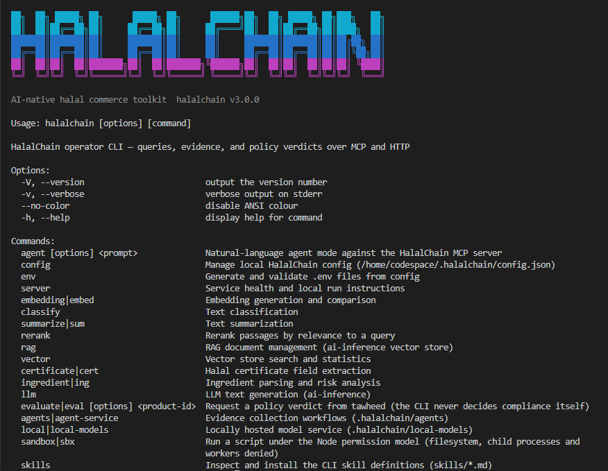

</p>

AI-native halal commerce and compliance platform for supplier verification, evidence collection, policy evaluation, and vendor-facing workflows. The repository combines a .NET modular platform, customer and marketplace front ends, Python AI/evidence services, and a local developer stack for running the full system together.

**Status:** Consolidating all prior decisions, including the contract test suite.
**Stack:** .NET 10 LTS (C# 14) · Python 3.11+ · Node 22+ · Aspire 13.5 · MCP C# SDK v2.0 · MAF 1.0-rc1 · AG-UI .NET SDK · Foundry stable, forge-std v1.15.0, Solidity ^0.8.24.

> This document is the consolidated architecture. `docs/ARCHITECTURE.md` is its canonical long-form home; this README is the entry point. Items described as *target state* are not yet in the tree — see [§16 Repository status](#16-repository-status).

---

## Table of contents

1. [Architectural principle](#1-architectural-principle)
2. [Layering and dependency rules](#2-layering-and-dependency-rules)
3. [Solution inventory](#3-solution-inventory)
4. [Storage layer](#4-storage-layer)
5. [Agentic layer](#5-agentic-layer)
6. [Blockchain module](#6-blockchain-module)
7. [Multivendor marketplace](#7-multivendor-marketplace)
8. [Trust boundary](#8-trust-boundary)
9. [Cross-component access map](#9-cross-component-access-map)
10. [Runtime topology](#10-runtime-topology)
11. [Complete workflow catalogue](#11-complete-workflow-catalogue)
12. [Architecture guard rules](#12-architecture-guard-rules)
13. [Build order](#13-build-order)
14. [Decisions requiring input](#14-decisions-requiring-input)
15. [Related documents](#15-related-documents)
16. [Repository status](#16-repository-status)

---

## 1. Architectural principle

> AI gathers evidence. Deterministic systems decide business and compliance outcomes.

The rule is enforced at seven layers, not asserted:

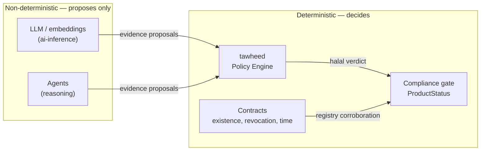

| Layer | Enforcement mechanism |
| --- | --- |
| Prompt | The root `Modelfile` system prompt for the local halal assistant |
| API | `Modules/Halal/` forwards to `tawheed` for evidence, never for verdicts |
| Storage | `ai-inference` and agents hold read-only blob credentials; `IBlobStore` has no `Delete` member |
| Agent runtime | `EvidenceProposal` has no verdict field. CI meta-test greps the agents package |
| Marketplace | `Product` holds a `VerdictBinding`, never an editable halal field. Only Compliance mutates `ProductStatus` |
| Blockchain | Contracts record existence, revocation, and timestamps. Never a verdict |
| Contract tests | Invariant tests assert revocation never yields `current`, and no contract declares a verdict type |

---

## 2. Layering and dependency rules

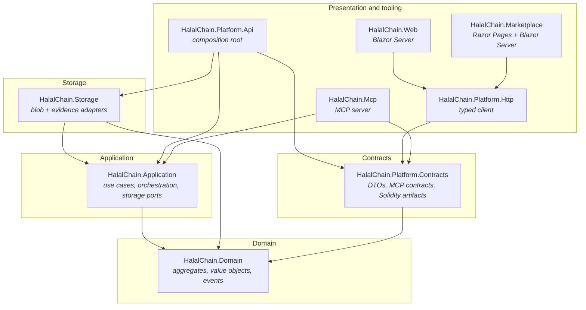

| Rule | Rationale |
| --- | --- |
| Domain references nothing I/O-free | Pure model. |
| Application references Domain only | Defines ports and use cases |
| Storage references Application and Domain | Leaf library. Never Api, Web, Marketplace, Mcp |
| `Platform.Api` is the only composition root referencing Storage | Single DI wiring point |
| Web and Marketplace reach the platform via `Platform.Http` | No direct storage access |
| Mcp is read-only and goes through Application ports | MCP read-only mandate |

---

## 3. Solution inventory

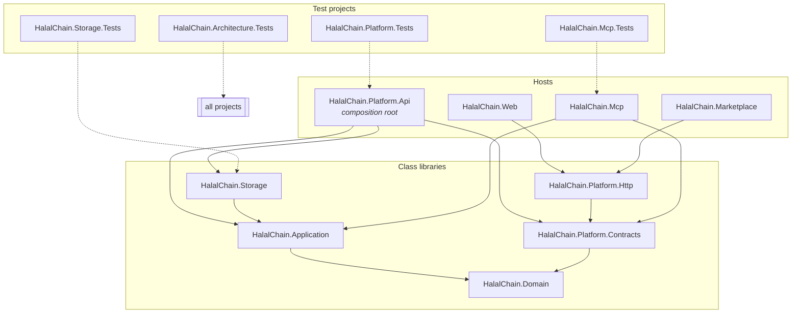

| Project | Type | Role |
| --- | --- | --- |
| `HalalChain.Domain` | class library | Aggregates, value objects, domain events |
| `HalalChain.Application` | class library | Use cases, behaviors, storage ports, agent orchestration |
| `HalalChain.Platform.Contracts` | class library | Shared DTOs, MCP contracts, AG-UI contracts, Solidity sources + Foundry artifacts |
| `HalalChain.Platform.Http` | class library | Typed `HttpClient`, AG-UI stream client, MCP client |
| `HalalChain.Platform.Api` | ASP.NET Core | Modular monolith — REST API + MCP host + AG-UI SSE |
| `HalalChain.Platform.Tests` | xUnit | API, persistence, vendor isolation |
| `HalalChain.Marketplace` | web app | Vendor UI, Razor Pages + Blazor Server + SignalR |
| `HalalChain.Web` | Blazor Server | Customer UI, Radzen |
| `HalalChain.Mcp` | console host | MCP v2.0 server, AOT-ready |
| `HalalChain.Mcp.Tests` | xUnit | MCP server tests |
| `HalalChain.Architecture.Tests` | xUnit | Architecture guard tests |
| `HalalChain.Storage` | class library | Blob and evidence storage adapters |
| `HalalChain.Storage.Tests` | xUnit | Adapter + contract tests |

`Radzen.Blazor.Api.Generator.csproj` sits alongside the API and is invoked only when `-p:GenerateApiPages=true`.

The Foundry project lives under `HalalChain.Platform.Contracts/contracts/` and is not a .NET project — it produces ABI artifacts consumed by the Contracts library.

---

## 4. Storage layer

### 4.1 Physical structure

```text
HalalChain.Application/
└─ Storage/
   ├─ IBlobStore.cs
   ├─ IEvidenceStore.cs
   ├─ ISignedUrlIssuer.cs
   ├─ IAccessLog.cs
   ├─ BlobRef.cs
   ├─ BlobMetadata.cs
   ├─ EvidenceId.cs
   ├─ EvidenceRecord.cs
   ├─ EvidenceDescriptor.cs
   ├─ EvidenceRead.cs
   └─ RetentionPolicy.cs

HalalChain.Storage/
├─ Adapters/{FileSystem,S3,Azure,Ipfs}/
├─ Integrity/{IContentHasher,Sha256ContentHasher,HashMismatchException}.cs
├─ Evidence/{EvidenceStore,EvidencePath,EvidenceAccessLogger,RetentionEvaluator}.cs
├─ DependencyInjection/StorageServiceCollectionExtensions.cs
└─ README.md
```

### 4.2 Ports

```csharp
public interface IBlobStore
{
    Task<BlobRef> PutAsync(Stream content, BlobMetadata meta, CancellationToken ct);
    Task<Stream?> OpenReadAsync(BlobRef reference, CancellationToken ct);
    Task<bool> ExistsAsync(BlobRef reference, CancellationToken ct);
    // Deliberately no DeleteAsync
}

public interface IEvidenceStore
{
    Task<EvidenceRecord> IngestAsync(Stream content, EvidenceDescriptor descriptor, CancellationToken ct);
    Task<EvidenceRead> OpenAsync(EvidenceId id, Actor actor, CancellationToken ct);
    Task<EvidenceRecord> GetRecordAsync(EvidenceId id, CancellationToken ct);
    Task<RetentionReport> ApplyRetentionAsync(RetentionPolicy policy, CancellationToken ct);
}
```

`IBlobStore` is the mechanism. `IEvidenceStore` is the domain concept. Content-addressed by SHA-256, lowercase hex, layout `{hash[0..2]}/{hash}`.

> **On the hasher choice (merge decision M1).** `Sha256ContentHasher` remains authoritative for `BlobRef` — it addresses storage. The Merkle tree in [§6.3](#63-keccak-merkle-tree-merge-decision-m1) uses a different hasher, keccak256, for on-chain node combination. Two hashers, two concerns. Conflating them breaks every inclusion proof.

### 4.3 Ingest flow

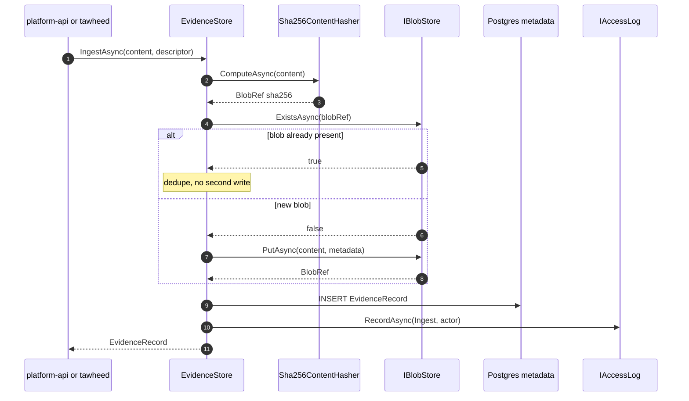

### 4.4 Read flow

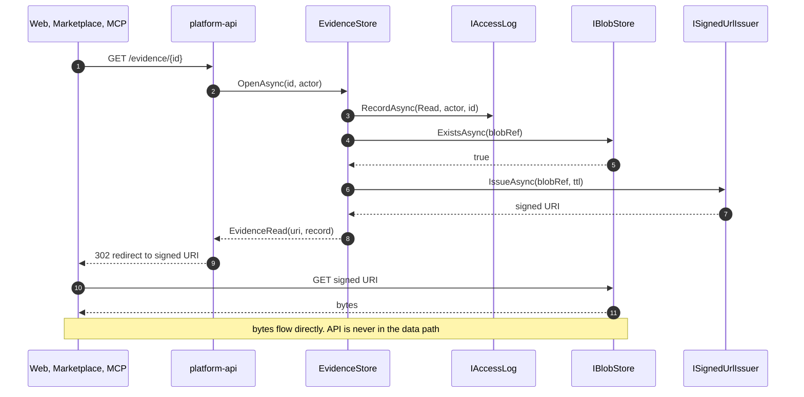

### 4.5 Retention flow

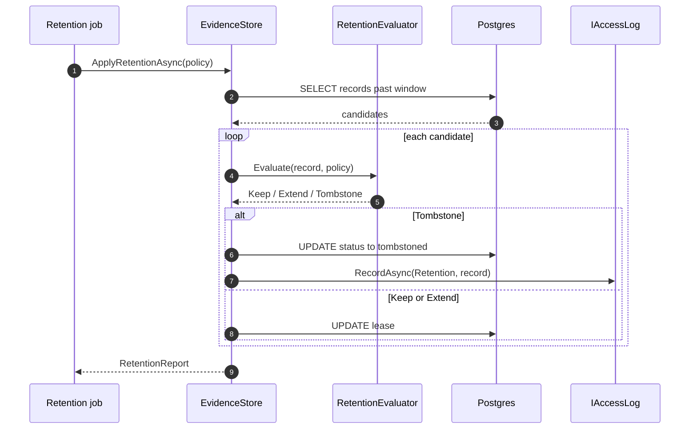

---

## 5. Agentic layer

### 5.1 Physical structure

```text
.halalchain/agents/
├── app/
│   ├── main.py
│   ├── runtime/{protocol,proposal,trace,tools,budget,escalation}.py
│   ├── agents/{collector,classifier,verifier,profiler,gap,explainer}.py
│   ├── workflows/
│   │   ├── supplier_onboarding.py
│   │   ├── certificate_review.py
│   │   ├── periodic_revalidation.py
│   │   └── ad_hoc_investigation.py
│   └── api/main.py
├── tests/
├── pyproject.toml
└── Dockerfile
```

### 5.2 Agent contract

```python
class EvidenceProposal(BaseModel):
    kind: EvidenceKind
    summary: str
    confidence: float
    source_refs: list[SourceRef]
    proposed_evidence: dict[str, Any]
    # Deliberately absent, enforced by CI grep:
    #   verdict, decision, is_halal, status, approved, rejected

class Agent(Protocol[In, Out]):
    name: str
    version: str
    tools: list[type[Tool]]

    async def run(self, ctx: RunContext, input: In) -> Out: ...
```

### 5.3 Agent taxonomy

| Agent | Purpose | Model use | Tools |
| --- | --- | --- | --- |
| collector | Discover and fetch candidate documents | light | http, blob read |
| classifier | Type and route a document | embeddings + LLM | blob read |
| verifier | Check certificate against issuer registry, expiry, scope | LLM + rules | http, blob read |
| profiler | Assemble supplier picture | LLM synthesis | blob read |
| gap | Identify missing evidence per policy requirement | LLM | policy read |
| explainer | Narrate an already-decided verdict | LLM | none |

`explainer` runs after `tawheed` decides. It never sees a case before the decision.

### 5.4 Workflow orchestration

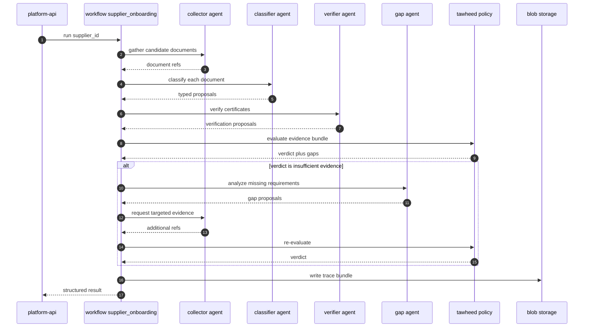

### 5.5 Provenance

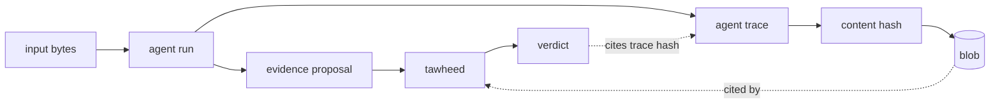

### 5.6 Budgets and escalation

```python
class WorkflowBudget(BaseModel):
    max_steps: int = 20
    max_tokens: int = 100_000
    max_wall_seconds: int = 120
    max_cost_usd: float = 1.00

class Escalation(BaseModel):
    reason: Literal["low_confidence", "novel_case",
                    "conflicting_evidence", "policy_ambiguous"]
    detail: str
    proposed_action: str
```

Exceeding any bound halts the workflow and escalates.

---

## 6. Blockchain module

### 6.1 Physical structure

```text
HalalChain.Platform.Api/
└─ Modules/
   └─ Blockchain/
      ├─ Features/
      │   ├─ AnchorEvidence/
      │   ├─ VerifyCertificate/
      │   ├─ QueryChainState/
      │   └─ ManageMerkleBatch/
      ├─ Contracts/
      │   ├─ IBlockchainClient.cs
      │   ├─ IAnchorService.cs
      │   ├─ IMerkleBatcher.cs
      │   ├─ AnchorReceipt.cs
      │   ├─ MerkleProof.cs
      │   └─ ChainMetadata.cs
      ├─ Infrastructure/
      │   ├─ Nethereum/{NethereumBlockchainClient,NethereumAnchorService,NethereumOptions}.cs
      │   ├─ Contracts/{EvidenceAnchor,CertificateRegistry,PolicyAnchor}Contract.cs
      │   └─ Merkle/{KeccakMerkleTree,DomainSeparatedHasher,MerkleProofGenerator}.cs
      └─ Abstractions/{AnchorStatus,ChainNetwork}.cs
```

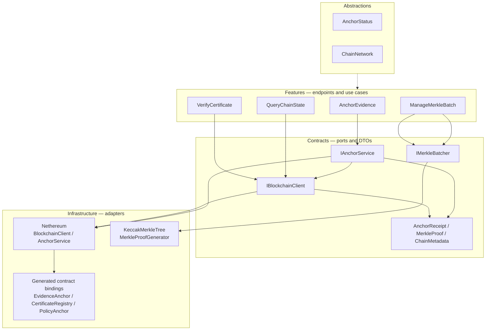

> Note `KeccakMerkleTree`, **not** `Sha256MerkleTree`. See [§6.3](#63-keccak-merkle-tree-merge-decision-m1).

### 6.2 Contract designs

`EvidenceAnchor.sol` — Merkle root anchoring, ~50k gas per batch. `anchorBatch` rejects empty batches (merge decision M2).

```solidity
contract EvidenceAnchor {
    struct AnchorRecord {
        bytes32 merkleRoot;
        uint256 batchIndex;
        uint256 timestamp;
        address submitter;
        string batchMetadataUri;
    }
    mapping(uint256 => AnchorRecord) public anchors;
    mapping(bytes32 => uint256) public rootToBatch;
    uint256 public latestBatchIndex;

    error RootAlreadyAnchored(bytes32 root);
    error EmptyBatch();

    event EvidenceAnchored(uint256 indexed batchIndex, bytes32 indexed merkleRoot,
                            uint256 timestamp, address submitter);

    function anchorBatch(bytes32 merkleRoot, string calldata batchMetadataUri)
        external returns (uint256 batchIndex)
    {
        if (merkleRoot == bytes32(0)) revert EmptyBatch();
        if (rootToBatch[merkleRoot] != 0) revert RootAlreadyAnchored(merkleRoot);
        batchIndex = ++latestBatchIndex;
        anchors[batchIndex] = AnchorRecord({
            merkleRoot: merkleRoot, batchIndex: batchIndex,
            timestamp: block.timestamp, submitter: msg.sender,
            batchMetadataUri: batchMetadataUri
        });
        rootToBatch[merkleRoot] = batchIndex;
        emit EvidenceAnchored(batchIndex, merkleRoot, block.timestamp, msg.sender);
    }

    function verifyInclusion(bytes32 leaf, bytes32[] calldata proof,
                              uint256 batchIndex) external view returns (bool) {
        bytes32 computed = leaf;
        for (uint256 i = 0; i < proof.length; i++) {
            computed = computed < proof[i]
                ? keccak256(abi.encodePacked(computed, proof[i]))
                : keccak256(abi.encodePacked(proof[i], computed));
        }
        return computed == anchors[batchIndex].merkleRoot;
    }
}
```

`CertificateRegistry.sol` — records existence, revocation, expiry. Never halal status. Constructor takes a registrar (merge decision M2).

```solidity
contract CertificateRegistry {
    struct CertificateRecord {
        bytes32 certificateHash;
        bytes32 vendorId;
        uint256 issuedAt;
        uint256 expiresAt;
        string issuerDid;
        bool revoked;
    }
    mapping(bytes32 => CertificateRecord) public certificates;
    mapping(bytes32 => bytes32[]) public vendorCertificates;
    address public registrar;

    error NotRegistrar(address caller);
    error CertificateExists(bytes32 certHash);
    error InvalidExpiry(uint256 expiresAt);

    event CertificateRegistered(bytes32 indexed certHash, bytes32 indexed vendorId);
    event CertificateRevoked(bytes32 indexed certHash, string reason);

    constructor(address _registrar) { registrar = _registrar; }

    modifier onlyRegistrar() {
        if (msg.sender != registrar) revert NotRegistrar(msg.sender);
        _;
    }

    function registerCertificate(bytes32 certHash, bytes32 vendorId,
                                  uint256 expiresAt, string calldata issuerDid)
        external onlyRegistrar
    {
        if (certificates[certHash].certificateHash != bytes32(0))
            revert CertificateExists(certHash);
        if (expiresAt <= block.timestamp) revert InvalidExpiry(expiresAt);
        certificates[certHash] = CertificateRecord({
            certificateHash: certHash, vendorId: vendorId,
            issuedAt: block.timestamp, expiresAt: expiresAt,
            issuerDid: issuerDid, revoked: false
        });
        vendorCertificates[vendorId].push(certHash);
        emit CertificateRegistered(certHash, vendorId);
    }

    function revokeCertificate(bytes32 certHash, string calldata reason)
        external onlyRegistrar
    {
        certificates[certHash].revoked = true;
        emit CertificateRevoked(certHash, reason);
    }

    /// @dev Strict `<` for expiry: valid up to but not including expiry timestamp.
    function isCurrent(bytes32 certHash) external view returns (bool) {
        CertificateRecord memory rec = certificates[certHash];
        return rec.certificateHash != bytes32(0)
            && !rec.revoked
            && block.timestamp < rec.expiresAt;
    }
}
```

`PolicyAnchor.sol` — anchors policy version hashes for verdict provenance.

```solidity
contract PolicyAnchor {
    mapping(bytes32 => uint256) public policyAnchoredAt;
    mapping(bytes32 => string) public policyMetadataUri;

    error PolicyAlreadyAnchored(bytes32 policyHash);

    event PolicyAnchored(bytes32 indexed policyHash, uint256 timestamp);

    function anchorPolicy(bytes32 policyHash, string calldata metadataUri) external {
        if (policyAnchoredAt[policyHash] != 0)
            revert PolicyAlreadyAnchored(policyHash);
        policyAnchoredAt[policyHash] = block.timestamp;
        policyMetadataUri[policyHash] = metadataUri;
        emit PolicyAnchored(policyHash, block.timestamp);
    }
}
```

### 6.3 Keccak Merkle tree (merge decision M1)

The C# tree must use keccak256 with sorted-pair combination for internal nodes, matching the contract's `verifyInclusion`. SHA-256 remains the storage hasher only.

```csharp
// Infrastructure/Merkle/KeccakMerkleTree.cs
public sealed class KeccakMerkleTree
{
    private readonly Sha3Keccack _keccak = new();

    /// <summary>
    /// Leaves are pre-hashed (SHA-256 from storage). Internal nodes use keccak256.
    /// Sorted-pair combination matches EvidenceAnchor.verifyInclusion.
    /// </summary>
    public MerkleResult Build(IReadOnlyList<byte[]> leaves)
    {
        if (leaves.Count == 0) throw new ArgumentException("Empty tree", nameof(leaves));

        var layer = leaves
            .Select(l => l.Length == 32 ? l : _keccak.CalculateHash(l))
            .ToList();
        var layers = new List<List<byte[]>> { layer };

        while (layer.Count > 1)
        {
            var next = new List<byte[]>((layer.Count + 1) / 2);
            for (int i = 0; i < layer.Count; i += 2)
            {
                var left  = layer[i];
                var right = i + 1 < layer.Count ? layer[i + 1] : left;
                next.Add(HashPair(left, right));
            }
            layers.Add(next);
            layer = next;
        }

        return new MerkleResult(Root: layer[0], Layers: layers, LeafCount: leaves.Count);
    }

    private byte[] HashPair(byte[] a, byte[] b)
    {
        var (lo, hi) = Compare(a, b) <= 0 ? (a, b) : (b, a);
        var buffer = new byte[64];
        Buffer.BlockCopy(lo, 0, buffer, 0, 32);
        Buffer.BlockCopy(hi, 0, buffer, 32, 32);
        return _keccak.CalculateHash(buffer);
    }

    private static int Compare(byte[] a, byte[] b)
    {
        for (int i = 0; i < 32; i++)
            if (a[i] != b[i]) return a[i] < b[i] ? -1 : 1;
        return 0;
    }
}
```

`DomainSeparatedHasher` is retained for future use but the tree does not call it. **The contract defines the tree shape; the C# code conforms to the contract, not the other way around.**

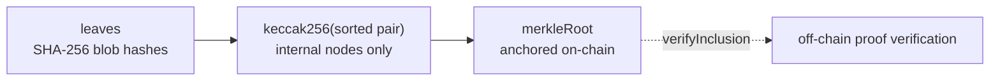

### 6.4 Chain selection

| Network | Use case | Finality |
| --- | --- | --- |
| Polygon Amoy | testnet | ~2s |
| Polygon zkEVM | Production, privacy | ~30 min |
| Polygon PoS | Production, low cost | ~5 min |
| Nethereum DevChain | Local tests, no Docker instant | — |

Nethereum v6.0.4 targets netstandard 2.0 through .NET 10, with Aspire orchestration and in-process DevChain.

### 6.5 Verification flow

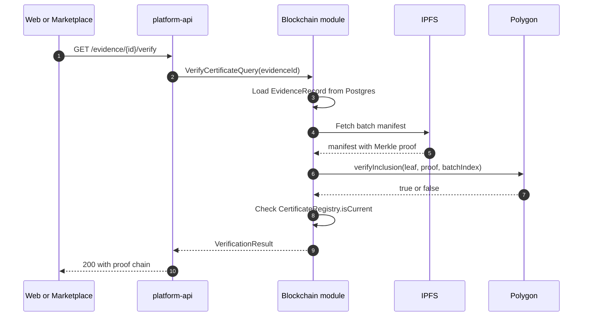

### 6.6 What NOT to anchor

| Data | On-chain? | Rationale |
| --- | --- | --- |
| Evidence SHA-256 hashes | Yes, as Merkle leaves | Integrity commitment |
| Merkle roots | Yes, per batch | Tamper-evident |
| Certificate expiry, revocation | Yes, in registry | Deterministic facts |
| Policy version hashes | Yes, in `PolicyAnchor` | Verdict provenance |
| Halal verdicts | No | A tawheed decision, not a chain fact |
| Evidence contents | No | Privacy, cost, GDPR |
| Vendor PII | No | Privacy |
| Agent traces | Hash only | Provenance without exposure |

### 6.7 Foundry test suite

#### 6.7.1 Project layout

```text
HalalChain.Platform.Contracts/contracts/
├── foundry.toml
├── remappings.txt
├── src/{EvidenceAnchor,CertificateRegistry,PolicyAnchor}.sol
├── test/
│   ├── utils/{MerkleHelper,TestActors,Errors}.sol
│   ├── unit/{EvidenceAnchor,CertificateRegistry,PolicyAnchor}.t.sol
│   ├── fuzz/{EvidenceAnchor,CertificateRegistry,PolicyAnchor}.fuzz.t.sol
│   ├── invariant/
│   │   ├── handlers/{EvidenceAnchorHandler,CertificateRegistryHandler}.sol
│   │   ├── EvidenceAnchor.invariant.t.sol
│   │   └── CertificateRegistry.invariant.t.sol
│   ├── merkle/MerkleProofParity.t.sol
│   └── integration/EndToEnd.t.sol
└── script/{Deploy.s.sol,AnchorBatch.s.sol}
```

#### 6.7.2 `foundry.toml`

```toml
[profile.default]
src = "src"
out = "out"
libs = ["lib"]
test = "test"
script = "script"
solc = "0.8.24"
optimizer = true
optimizer_runs = 200
via_ir = false
evm_version = "cancun"
gas_reports = ["EvidenceAnchor", "CertificateRegistry", "PolicyAnchor"]

[profile.ci]
fuzz = { runs = 10000 }
invariant = { runs = 512, depth = 64, fail_on_revert = false }
verbosity = 3

[profile.production]
via_ir = true
optimizer_runs = 10000
```

#### 6.7.3 Critical test — Merkle parity

The most important test in the suite is `test_parityWithOpenZeppelin`. It asserts the C# `KeccakMerkleTree` and the Solidity `verifyInclusion` agree with OpenZeppelin's canonical verifier. Without this test, M1 (the SHA-256/Keccak fix) would silently regress.

```solidity
function test_parityWithOpenZeppelin(bytes32[] memory raw) public pure {
    uint256 n = (raw.length % 32) + 1;
    bytes32[] memory leaves = new bytes32[](n);
    for (uint256 i = 0; i < n; i++) {
        leaves[i] = keccak256(abi.encodePacked(raw[i % raw.length], i));
    }
    bytes32 root = MerkleHelper.buildRoot(leaves);
    for (uint256 i = 0; i < n; i++) {
        bytes32[] memory proof = MerkleHelper.buildProof(leaves, i);
        assertTrue(MerkleProof.verify(proof, root, leaves[i]));
    }
}
```

#### 6.7.4 Test categories and coverage

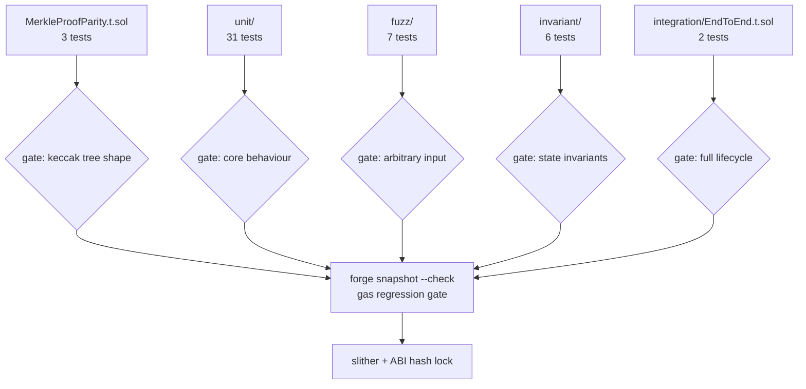

| Category | Tests | What it proves |
| --- | --- | --- |
| Unit — EvidenceAnchor | 12 | anchor, dedupe, events, inclusion for even/odd/1-leaf, tamper rejection, gas ceiling |
| Unit — CertificateRegistry | 14 | constructor, register, revoke, expiry boundary exclusive, duplicate rejection, past-expiry rejection |
| Unit — PolicyAnchor | 5 | anchor, metadata URI, duplicate rejection, distinct hashes |
| Fuzz — EvidenceAnchor | 4 | every leaf in every tree verifies; outsider leaves never verify; batch index monotonic; duplicate roots always revert |
| Fuzz — CertificateRegistry | 3 | expiry boundary holds under arbitrary TTL; revocation always wins |
| Invariant — EvidenceAnchor | 4 | batch index equals successful anchors; every root maps; uniqueness of batch indices |
| Invariant — CertificateRegistry | 2 | revoked never current; every registration corresponds to a real hash |
| Parity — Merkle | 3 | agrees with OpenZeppelin; single-leaf root is leaf; odd-layer duplication |
| Integration — full lifecycle | 2 | register → anchor → verify → policy → expiry flips |

#### 6.7.5 Gas baselines

| Function | Ceiling (gas) |
| --- | --- |
| `anchorBatch` (first) | 60,000 |
| `anchorBatch` (subsequent) | 45,000 |
| `registerCertificate` | 90,000 |
| `revokeCertificate` | 30,000 |
| `anchorPolicy` | 45,000 |

Baseline recorded via `forge snapshot --snap .gas-snapshot`. CI gates on `forge snapshot --check`. A regression fails the build.

#### 6.7.6 CI workflow

```yaml
name: Contracts
on:
  pull_request:
    paths: ["HalalChain.Platform.Contracts/contracts/**"]
jobs:
  test:
    runs-on: ubuntu-latest
    steps:
      - uses: actions/checkout@v4
        with: { submodules: recursive }
      - uses: foundry-rs/foundry-toolchain@v1
        with: { version: stable }
      - name: Build
        working-directory: HalalChain.Platform.Contracts/contracts
        run: forge build --sizes
      - name: Unit + fuzz + invariant
        working-directory: HalalChain.Platform.Contracts/contracts
        run: FOUNDRY_PROFILE=ci forge test -vvv
      - name: Gas snapshot
        working-directory: HalalChain.Platform.Contracts/contracts
        run: forge snapshot --check .gas-snapshot
      - name: Coverage
        working-directory: HalalChain.Platform.Contracts/contracts
        run: forge coverage --report lcov
      - uses: crytic/slither-action@v0.4.0
        with: { target: HalalChain.Platform.Contracts/contracts/ }
```

### 6.8 Contract build order

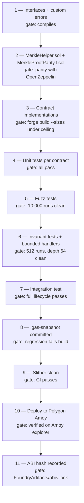

Steps 1 and 2 before 3 is the "constraints before code" ordering again. The Merkle parity test exists *before* the contracts it constrains. The `KeccakMerkleTree` C# code (merge M1) depends on the parity test passing on the Solidity side first.

---

## 7. Multivendor marketplace

### 7.1 Bounded contexts

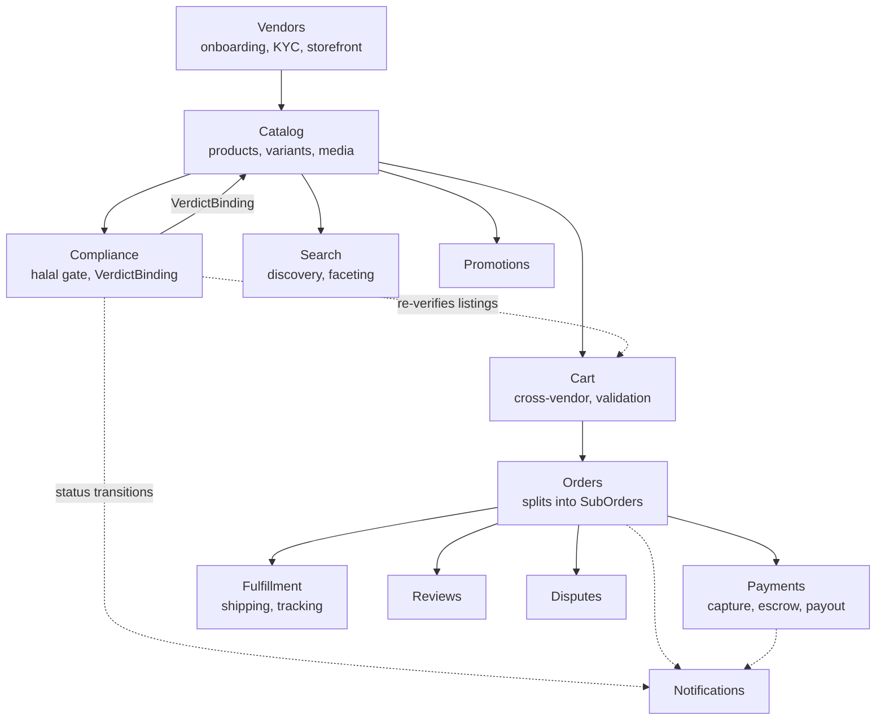

| Module | Responsibility | Depends on |
| --- | --- | --- |
| Vendors | Seller onboarding, KYC, storefront lifecycle | Storage, Agents |
| Catalog | Products, variants, categories, media | Storage, Compliance |
| Compliance | Halal gate, certificate binding, verdict projection | tawheed, Storage |
| Search | Discovery, faceting, halal filters | Catalog read model |
| Cart | Cross-vendor cart, validation | Catalog, Compliance |
| Orders | Placement, split into vendor sub-orders | Cart, Payments |
| Payments | Capture, split, escrow, payout, refund | Orders |
| Fulfillment | Per-vendor shipping, tracking, delivery | Orders |
| Reviews | Buyer feedback, seller reputation | Orders |
| Promotions | Vouchers, discounts, campaigns | Catalog |
| Disputes | Returns, RMA, resolution | Orders, Payments |
| Notifications | Email, SMS, push | all |

Compliance owns no products and issues no verdicts. It holds the binding between product, certificate blob, and tawheed verdict, and is the only module permitted to mutate `ProductStatus`.

### 7.2 Compliance gate state machine

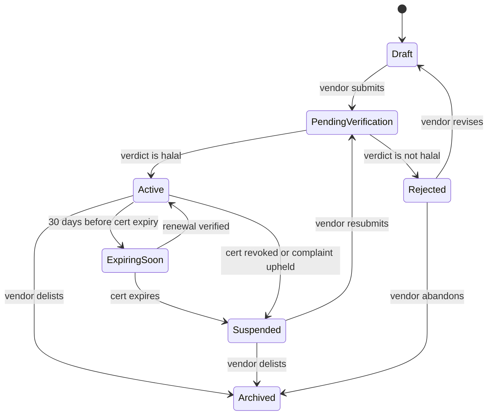

`ExpiringSoon` is a real state, not a notification. `Suspended` is automatic. The expiry sweep is a deterministic hosted service.

The `ExpiringSoon` state is where the blockchain module and the compliance gate meet: the sweep reads `CertificateRegistry.isCurrent` for on-chain corroboration, and tawheed for the halal decision. The registry says "this certificate exists, is not revoked, and has not expired." tawheed says whether the underlying evidence still satisfies policy.

### 7.3 Order lifecycle

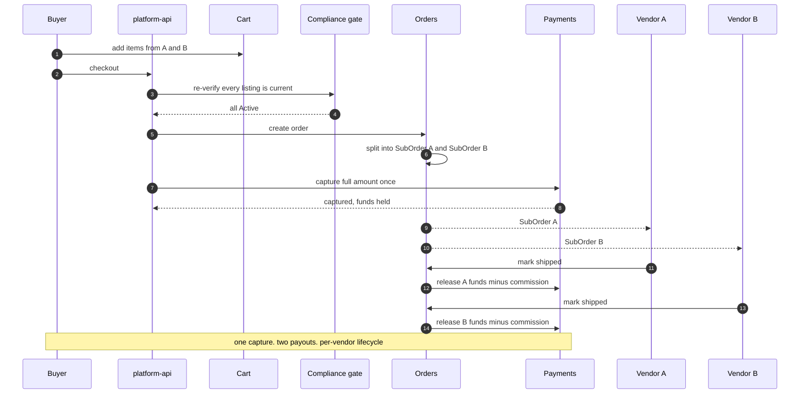

Compliance re-verification at checkout is not optional and not cacheable.

### 7.4 Halal finance constraints

- **No riba.** Revenue is a fixed service fee (ujrah) stated at listing.
- **No gharar.** Delivery terms stated before capture.
- **Wakala-based escrow.** Funds held under agency, documented.
- **Zakat and sadaqah pass-through.** Separate line item. No commingling.

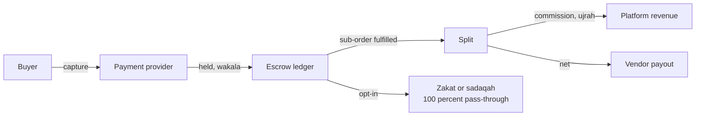

### 7.5 Domain aggregates

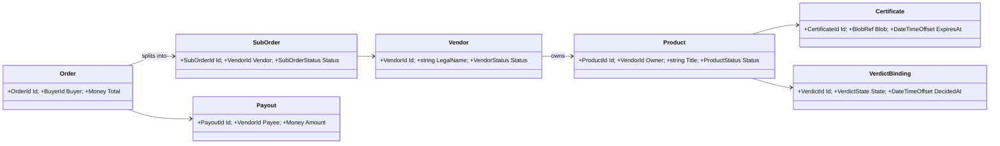

`Product` has no `IsHalal` boolean. It has a `VerdictBinding`.

---

## 8. Trust boundary

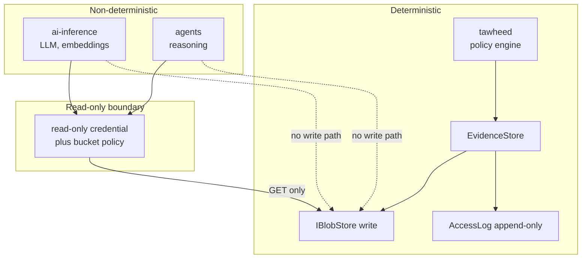

Enforcement layers:

1. **IAM / bucket policy.** `ai-inference` and agents hold credentials with `GetObject` only. No `PutObject`, no `DeleteObject`. This is the real boundary.
2. **Separate config keys.** `BLOB__S3__ACCESS_KEY` vs `BLOB__S3__READONLY_KEY`. Reasoning services never see the write key.
3. **CI config-lint.** Pipeline fails if either reasoning service is wired to the write key.

For the blockchain layer, the equivalent enforcement: the registrar keypair is held by `tawheed`, not by agents and not by the API. The API submits anchor transactions through a service account that has `anchorBatch` permission and nothing else.

---

## 9. Cross-component access map

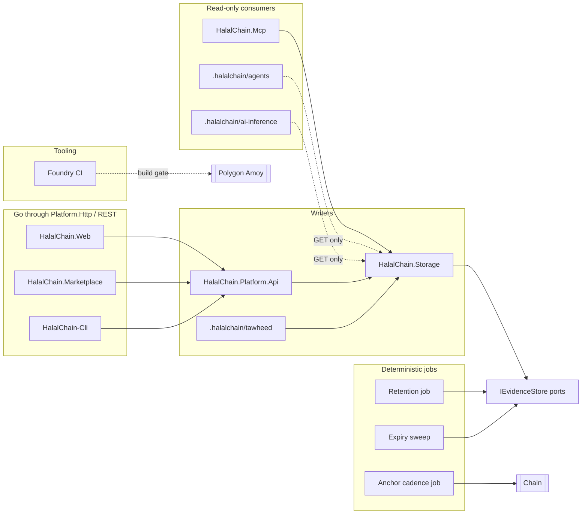

| Project / service | Writes | Reads | Access path | Notes |
| --- | --- | --- | --- | --- |
| `HalalChain.Application` | no | no | defines ports | `IBlobStore`, `IEvidenceStore` |
| `HalalChain.Storage` | yes | yes | implements ports | only writer of bytes |
| `HalalChain.Platform.Api` | yes | yes | `IEvidenceStore` | composition root |
| `HalalChain.Mcp` | no | yes | `IBlobStore` | read-only, MCP read-only mandate |
| `HalalChain.Web` | via API | via API | HTTP | never touches storage |
| `HalalChain.Marketplace` | via API | via API | HTTP + SignalR | same |
| `.halalchain/tawheed` | yes | yes | S3 SDK write creds | evidence ingest + policy |
| `.halalchain/agents` | no | yes | S3 SDK read-only creds | proposals only |
| `.halalchain/ai-inference` | no | yes | S3 SDK read-only creds | model access |
| `HalalChain-Cli` | via API | via API | HTTP | operator tooling |
| Retention job | tombstone only | yes | `IEvidenceStore` | deterministic |
| Expiry sweep | no | yes | Catalog read + `CertificateRegistry.isCurrent` | deterministic |
| Anchor cadence job | anchors Merkle roots | reads evidence hashes | `IAnchorService` | deterministic batching |
| Foundry CI | deploys to Amoy | reads ABI | forge CLI | build gate, not runtime |

---

## 10. Runtime topology

```mermaid
flowchart LR
  subgraph Dev["Local dev stack"]
    APId["platform-api"]
    TWd["tawheed"]
    AGd["agents"]
    AId["ai-inference"]
    FS["FileSystemBlobStore<br/>./.data/blobs"]
    MIN["MinIO<br/>:9000"]
    IPFS["IPFS<br/>chain profile"]
    DEV["DevChain<br/>Nethereum"]
  end
  subgraph Prod["Production"]
    APIp["platform-api"]
    TWp["tawheed"]
    AGp["agents"]
    AIp["ai-inference"]
    S3["S3 or R2 or B2"]
    AZ["Azure Blob<br/>if committed"]
    POLY["Polygon zkEVM or PoS"]
  end

  APId --> FS
  APId -.->|storage profile| MIN
  TWd --> MIN
  AGd -.->|read-only| MIN
  AId -.->|read-only| MIN
  APId -.->|chain profile| IPFS
  APId -.->|chain profile| DEV

  APIp --> S3
  TWp --> S3
  AGp -.->|read-only| S3
  AIp -.->|read-only| S3
  APIp -.->|optional| AZ
  APIp --> POLY
```

Local defaults to filesystem. MinIO sits behind a storage profile, mirroring IPFS and DevChain behind `chain`. Foundry runs as tooling, not a service.

---

## 11. Complete workflow catalogue

```mermaid
flowchart TB
  subgraph EVID["Evidence layer — §4"]
    W1["1 Evidence ingest"]
    W2["2 Evidence read"]
    W3["3 Retention sweep"]
  end
  subgraph AGENT["Agentic layer — §5"]
    W5["5 Supplier onboarding"]
    W6["6 Certificate review"]
    W17["17 Agent escalation"]
  end
  subgraph MKT["Marketplace — §7"]
    W7["7 Product listing"]
    W8["8 Catalog search"]
    W9["9 Add to cart"]
    W10["10 Checkout"]
    W11["11 Payment capture"]
    W12["12 Sub-order fulfillment"]
    W13["13 Payout release"]
    W16["16 Dispute resolution"]
  end
  subgraph CHAIN["Blockchain layer — §6"]
    W14["14 Evidence anchoring"]
    W15["15 Certificate verification"]
  end
  subgraph OPS["Operations and delivery"]
    W4["4 Certificate expiry sweep"]
    W18["18 Contract change PR"]
    W19["19 Amoy deployment"]
  end

  W1 --> W5 --> W6 --> W7 --> W8 --> W9 --> W10
  W10 --> W11 --> W12 --> W13
  W7 -.->|re-verifies at checkout| W10
  W5 -.->|evidence| W14
  W6 --> W14
  W14 --> W15
  W2 --> W15
  W12 -.->|dispute trigger| W16
  W6 -.->|low confidence| W17
  W18 --> W19
```

| # | Workflow | Trigger | Participants | Output |
| --- | --- | --- | --- | --- |
| 1 | Evidence ingest | Evidence arrives | API/tawheed, `EvidenceStore`, Blob, `AccessLog` | `EvidenceRecord` |
| 2 | Evidence read | Client request | API, `EvidenceStore`, `SignedUrlIssuer` | Signed URI |
| 3 | Retention sweep | Scheduled | `EvidenceStore`, `RetentionEvaluator` | `RetentionReport` |
| 4 | Certificate expiry sweep | Scheduled (daily) | Compliance, Catalog, `CertificateRegistry.isCurrent` | Status transitions |
| 5 | Supplier onboarding | New vendor registers | Agent workflow, tawheed, Storage | Verdict + evidence bundle |
| 6 | Certificate review | Certificate submitted | Classifier, Verifier, tawheed | Verification proposals |
| 7 | Product listing | Vendor publishes | Compliance gate | `VerdictBinding` set |
| 8 | Catalog search | Buyer query | Search, Catalog read model | Ranked results |
| 9 | Add to cart | Buyer action | Cart, Catalog, Compliance | Cart updated |
| 10 | Checkout | Buyer confirms | Compliance re-verify, Orders, Payments | Order + SubOrders |
| 11 | Payment capture | Order placed | Payments, PSP | Captured funds |
| 12 | Sub-order fulfillment | Vendor ships | Fulfillment, Orders | Tracking updated |
| 13 | Payout release | Sub-order delivered | Payments | Vendor payout |
| 14 | Evidence anchoring | Scheduled (hourly) | Blockchain, `MerkleBatcher`, Polygon | `AnchorReceipt` |
| 15 | Certificate verification | Client request | Blockchain, IPFS, Polygon | `VerificationResult` |
| 16 | Dispute resolution | Buyer or vendor files | Disputes, Orders, Payments | Resolution record |
| 17 | Agent escalation | Confidence below threshold | Agent runtime, human reviewer | Escalation resolved |
| 18 | Contract change | PR | Foundry CI: build, unit, fuzz, invariant, gas, Slither | ABI hash recorded |
| 19 | Amoy deployment | Contract release | Foundry `script/Deploy.s.sol` | Verified addresses in `service-manifest.yaml` |

---

## 12. Architecture guard rules

Build-breaking in `HalalChain.Architecture.Tests` unless noted:

| Rule | Rationale |
| --- | --- |
| Domain must not reference Storage | Domain stays I/O-free |
| Storage must not reference Api, Web, Marketplace, Mcp | Storage is a leaf |
| `IBlobStore` declares no `Delete` member | Append-only is compile-time |
| `Platform.Http` must not reference Storage | Front ends go through API |
| Agent output models contain no verdict field | CI grep over agents package |
| Neither `ai-inference` nor agents wired to blob write key | CI config-lint |
| Every `IEvidenceStore.OpenAsync` emits an `IAccessLog` entry | Integration test |
| `Product` has no settable halal field | Aggregate inspection |
| Only Compliance mutates `ProductStatus` | Write-path arch test |
| Every vendor-scoped query carries a tenant filter | Per-module integration test |
| Payments has no interest-bearing type | Namespace arch test |
| Zakat and sadaqah line items are pass-through only | Financial reconciliation test |
| Blockchain must not reference Compliance | Chain is downstream of decisions |
| Blockchain must not call `IEvidenceStore.IngestAsync` | Anchor is read-only |
| No type in Blockchain declares `Verdict` or `HalalStatus` | Chain never judges |
| `EvidenceAnchor` ABI matches the deployed contract hash | CI check against `FoundryArtifacts/abis.lock` |
| `Sha256MerkleTree` must not exist | Prevents reversion to SHA-256 internal nodes |
| `KeccakMerkleTree` is the only `IMerkleTree` implementation | Single source of truth for on-chain tree shape |
| No Solidity contract declares `halal`, `verdict`, or `approved` | Solidity-level grep, analogous to the agents-package rule |

```mermaid
flowchart LR
  subgraph A["Storage invariants"]
    A1["IBlobStore has no Delete"]
    A2["Storage is a leaf"]
    A3["OpenAsync always logs"]
  end
  subgraph B["Decision invariants"]
    B1["No verdict in agents"]
    B2["No halal field on Product"]
    B3["Only Compliance mutates ProductStatus"]
    B4["Blockchain declares no verdict"]
  end
  subgraph C["Merkle invariants — new"]
    C1["No Sha256MerkleTree"]
    C2["KeccakMerkleTree is the only tree"]
    C3["Parity test proves shape"]
    C4["ABI hash lock"]
  end
  subgraph D["Money invariants"]
    D1["No riba — no interest type"]
    D2["Zakat pass-through only"]
  end
  A --> ALL["Architecture.Tests<br/>build-breaking"]
  B --> ALL
  C --> ALL
  D --> ALL
```

The last three rules are new, and they close the gap the merge exposed. Without them, a future contributor could reintroduce SHA-256 nodes and every contract test would still pass, because the tests only exercise the Solidity side.

---

## 13. Build order

```mermaid
flowchart TB
  G1{{"5 — CI meta-test:<br/>no verdict fields"}} -.-> S6
  G2{{"12 — Merkle parity test<br/>before the contracts"}} -.-> S13
  G2 -.-> S20
  G3{{"18 — .gas-snapshot<br/>CI gate active"}} -.-> S25
  G4{{"26 — Blockchain arch tests<br/>before blockchain features"}} -.-> S24

  S1["1-4 Storage ports, adapters,<br/>arch tests, agent runtime"] --> S6
  S6["6 explainer agent<br/>(post-decision canary)"] --> S7["7-10 Vendors, Compliance,<br/>Catalog, expiry sweep"]
  S7 --> S11["11 Interfaces + custom errors"]
  S11 --> S13["13 Contract implementations"]
  S13 --> S14["14-17 Unit, fuzz, invariant,<br/>integration tests"]
  S14 --> S19["19 Slither clean"]
  S19 --> S20["20 KeccakMerkleTree C#<br/>+ parity vs Solidity"]
  S20 --> S21["21-23 Client port, Amoy deploy,<br/>Nethereum adapter"]
  S21 --> S24["24-25 Anchor cadence,<br/>verification endpoint"]
  S24 --> S27["27-28 Search + Cart,<br/>Orders + Fulfillment"]
  S27 --> S29["29-35 verifier agents, S3/MinIO,<br/>Payments, remaining agents, workflows, docs"]
```

| # | Step | Gate |
| --- | --- | --- |
| 1 | Reconcile project count in `AGENTS.md` | `dotnet sln list` |
| 2 | Storage ports + `FileSystemBlobStore` + `Sha256ContentHasher` + contract tests | No infra changes |
| 3 | Storage arch tests | Filesystem-only shape |
| 4 | `agents/runtime/` — protocol, proposal, trace, budget, escalation | No agents yet |
| 5 | CI meta-test grepping for forbidden verdict fields | Before first agent |
| 6 | explainer agent | Safest canary. Post-decision |
| 7 | Vendors + Storefront | No listing without seller |
| 8 | Compliance module — state machine, `VerdictBinding`, arch tests | Before Catalog |
| 9 | Catalog — products, variants, media, certificates | Gate must exist |
| 10 | Certificate expiry sweep | Ships with Catalog |
| 11 | Solidity contract interfaces and custom errors | Compiles |
| 12 | `MerkleHelper.sol` + parity test vs OpenZeppelin | Parity green |
| 13 | Contract implementations | `forge build --sizes` under ceiling |
| 14 | Contract unit tests | All pass |
| 15 | Contract fuzz tests (10k runs) | Clean in CI |
| 16 | Contract invariant tests (512 runs, depth 64) | Clean in CI |
| 17 | Contract integration test | Full lifecycle passes |
| 18 | `.gas-snapshot` committed, CI gate active | Regression fails build |
| 19 | Slither clean | CI passes |
| 20 | `KeccakMerkleTree` C# implementation + parity against Solidity | Matches `MerkleHelper` output |
| 21 | `IBlockchainClient` port + `InMemoryBlockchainClient` | No Nethereum yet |
| 22 | Deploy to Polygon Amoy | Verified on explorer, addresses in manifest |
| 23 | Nethereum adapter against DevChain | Aspire orchestration |
| 24 | Anchor cadence hosted service | Batches hourly |
| 25 | Verification endpoint + inclusion proof | End-to-end |
| 26 | Blockchain arch tests (§12 new rules) | Constraints before features |
| 27 | Search + Cart with checkout re-verification | Last chance to prevent violation |
| 28 | Orders + Fulfillment — sub-order split | Per-vendor lifecycle |
| 29 | classifier + verifier agents | Real value, bounded scope |
| 30 | `S3BlobStore` + MinIO under storage profile | `service-manifest.yaml` update |
| 31 | Payments module | After PSP procurement decision |
| 32 | collector, profiler, gap agents | Touch external systems |
| 33 | `workflows/supplier_onboarding` | First end-to-end path |
| 34 | Reviews, Promotions, Disputes | Accretive, non-blocking |
| 35 | Three docs updated in one pass | Against settled shape |

Steps 5, 12, 18, and 26 are the "constraints before code" gates. Step 12 is new from the merge — the Merkle parity test exists before the contracts it constrains and before the C# tree that mirrors it. Step 20 is gated on 12, because the C# tree must conform to the parity-proven Solidity tree, not the reverse.

---

## 14. Decisions requiring input

```mermaid
flowchart LR
  D1["1 Payment provider<br/>blocks step 31"] --> P1["Must support wakala escrow, no riba.<br/>Constrains Payments module."]
  D2["2 Jurisdiction scoping<br/>blocks step 8"] --> P2["if cross-border:<br/>Compliance key becomes (product, market)"]
  D3["3 Production chain<br/>blocks step 22"] --> P3["zkEVM (privacy, slow)<br/>vs PoS (fast, cheap)"]
  D4["4 Image tag pinning"] --> P4["Qdrant untagged, MinIO bare-major.<br/>Pin both."]
  D5["5 Agent framework stability<br/>steps 4-6"] --> P5["MAF 1.0-rc1. If production<br/>stability needed, keep agents behind a flag"]
  D6["6 Registrar key custody<br/>blocks step 22"] --> P6["Hot wallet (simple, risk)<br/>vs KMS signer (safer, more infra)"]
  D7["7 Anchor cadence<br/>step 24"] --> P7["Fixed vs gas-price-adaptive.<br/>AnchorCadence is a ceiling either way."]
```

| # | Decision | Blocks | Options |
| --- | --- | --- | --- |
| 1 | Payment provider selection | Step 31 | Must support wakala escrow, no riba. Constrains Payments module. |
| 2 | Jurisdiction scoping | Step 8 | if cross-border: if international, Compliance key changes from `(product)` to `(product, market)` |
| 3 | Chain network for production | Step 22 | Polygon zkEVM (privacy, slow finality) vs PoS (fast, cheaper) |
| 4 | Qdrant and MinIO image tags | Docs | Currently untagged and bare-major respectively. Pin both. |
| 5 | Agent Framework stability | Steps 4–6 | MAF 1.0-rc1. If production stability needed, keep agents behind a feature flag |
| 6 | Registrar key custody | Step 22 | Hot wallet (simple, risk) vs KMS-backed signer (safer, more infra). The registrar key authorizes certificate registration — its compromise means anyone can register fake certificates. |
| 7 | Anchor cadence adaptation | Step 24 | Fixed interval vs gas-price-adaptive. Fixed is simpler; adaptive is meaningfully cheaper on PoS. The `AnchorCadence` config should be a ceiling either way. |

---

## 15. Related documents

| Document | Purpose |
|----------|---------|
| [`docs/ARCHITECTURE.md`](docs/ARCHITECTURE.md) | Full architecture, decisions, trade-offs |
| [`docs/DASHBOARD_ARCHITECTURE.md`](docs/DASHBOARD_ARCHITECTURE.md) | Multi-tenant dashboard framework design |
| [`docs/DASHBOARD_OPERATIONS.md`](docs/DASHBOARD_OPERATIONS.md) | Dashboard deployment, operations, troubleshooting |
| [`docs/FOUNDRY_LEVERAGE.md`](docs/FOUNDRY_LEVERAGE.md) | Foundry testing automation for smart contracts |
| [`docs/runbooks/`](docs/runbooks/) | Operational procedures |
| [`AGENTS.md`](AGENTS.md) | Development and testing guide for this project |

- `AGENTS.md` — build, test, and repository conventions
- `docs/ARCHITECTURE.md` — this document's canonical long-form home
- `docs/FOUNDRY_LEVERAGE.md` — Foundry and local chain
- `docs/local-development.md` — developer workflow
- `docs/architecture/tech-debt.md` — tech debt register (current findings, severities, verified evidence)
- `docs/runbooks/` — operational procedures
- `service-manifest.yaml` — canonical service inventory
- `HalalChain.Platform.Contracts/contracts/README.md` — contract-specific build, test, deploy

### Quick start

```bash
# .NET
dotnet restore HalalChain.Platform.sln
dotnet build   HalalChain.Platform.sln -c Release
dotnet test    HalalChain.Platform.sln -c Release --no-build

# Contracts
cd HalalChain.Platform.Contracts/contracts && forge build && forge test

# Full local stack
npm install
docker compose up --build
```

See `AGENTS.md` for ports, configuration, and the development overlay.

---

## 16. Repository status

The current tree, as of this consolidation:

```text
.
├── AGENTS.md                     # Contributor/build guide
├── HalalChain.Platform.sln      # 18 .NET projects
├── Directory.Build.props        # Shared .NET defaults (net10.0, nullable, implicit usings)
├── global.json                  # Pins the .NET SDK (10.0.200, latestFeature roll-forward)
├── docker-compose.yml           # Full local stack
├── service-manifest.yaml        # Canonical service inventory and ports
├── Modelfile                    # Local assistant system prompt for Ollama/OpenClaw
├── package.json                 # Root Node workspace scripts
├── README.md                    # This document
├── docs/                        # Architecture, development, ADRs, runbooks
├── infrastructure/              # Compose overlays and helper scripts
├── deploy/                      # Deployment assets
├── scripts/                     # Supporting scripts
├── HalalChain-Cli/              # Node-based operator/CLI toolkit
├── HalalChain.Application/      # Application layer
├── HalalChain.Domain/           # Domain model
├── HalalChain.Platform.Api/     # ASP.NET Core modular monolith (Modules/: AI, Auth, Blockchain,
│                                #   Catalog, Commerce, Events, Halal, Indexer, Ipfs, Vendors, Verification)
├── HalalChain.Platform.Contracts/ # Shared DTOs + contracts/ (Foundry, forge-std vendored)
├── HalalChain.Platform.Http/    # Typed HTTP client
├── HalalChain.Platform.Tests/   # API and platform integration tests
├── HalalChain.Web/              # Customer-facing Blazor Server UI
├── HalalChain.Marketplace/      # Vendor marketplace UI
├── HalalChain.Mcp/              # MCP server
├── HalalChain.Mcp.Tests/        # MCP server tests
├── HalalChain.Architecture.Tests/ # Architecture guard tests
├── HalalChain.Storage/          # Blob and evidence storage adapters
├── HalalChain.Storage.Tests/    # Adapter + contract tests
├── HalalChain.Agents/           # Agent eval DAG + agent runtime client
├── HalalChain.Agents.Tests/     # Eval DAG, budget, runtime, verdict boundary
├── HalalChain.DataFlow/         # PostgreSQL data flow source/destination components
├── HalalChain.DataFlow.Tests/   # Data flow normalizer, validator, dead-letter, SQL guards
├── HalalChain.Automation/        # Scheduled jobs host
└── .halalchain/
    ├── _shared/                 # Shared Python package (LLM provider, cache abstraction)
    ├── ai-inference/            # FastAPI AI gateway
    ├── tawheed/                 # FastAPI evidence ingestion + deterministic Policy Engine
    ├── agents/                  # FastAPI agent orchestration and evidence collection
    ├── local-models/            # Local model hosting for AI gateway and policy engine
    ├── requirements/            # Pinned dependency lock files
    └── config.json              # Local-only shared config placeholder
```

Described in this document but **not yet present in the tree** (they are build-order targets, not shipped components):

| Component | Section | Build-order step |
| --- | --- | --- |
| `HalalChain.Application/Storage` ports | §4.2 | 2 |
| `.halalchain/agents/` package | §5 | 4–6 |
| `EvidenceAnchor`, `CertificateRegistry`, `PolicyAnchor` Solidity | §6.2 | 13 |
| `KeccakMerkleTree` (currently no Merkle tree exists in `Modules/Blockchain`) | §6.3 | 20 |
| Foundry test suite (only `forge-std` is vendored today) | §6.7 | 12–18 |
| Multivendor marketplace modules | §7 | 7–13 |

`AGENTS.md` is now reconciled (13 projects).

---

## Closing notes

**The `Sha256MerkleTree` → `KeccakMerkleTree` fix is the entire reason this merge was worth doing.** Without the Foundry tests beside the architecture, the hasher mismatch would have shipped. The architecture doc looked coherent; the contracts looked coherent; the integration would have failed on the first `verifyInclusion` call. The parity test in [§6.7.3](#673-critical-test--merkle-parity) is now the gate that makes this class of bug impossible to reintroduce.

**Registrar key custody (decision 6) is the sharpest security concern in the whole system.** A compromised registrar key lets an attacker register arbitrary certificate hashes, and the platform will treat them as current. This is a KMS-or-nothing decision — hot wallet only for Amoy. If the platform is ever audited, this is the first thing the auditor will ask about.

**Gas price volatility on Polygon PoS means the anchor cadence should adapt, not be fixed.** Anchor more frequently when gas is low, batch more aggressively when it spikes. The `AnchorCadence` config should be a ceiling, not a fixed interval. On zkEVM this matters less because gas costs are more stable, but zkEVM finality is significantly slower — if the compliance workflow requires near-real-time verification, use PoS and accept the volatility.
