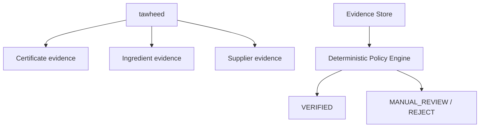

# HalalChain Platform — Architecture

> AI discovers and interprets evidence. Deterministic systems decide business and compliance outcomes.

## 1. System Overview

```mermaid
flowchart LR
    User[Users / Vendors] --> halalchain[halalchain
Blazor Server
:5200]
    User --> marketplace[marketplace
Razor Pages + Blazor Server + SignalR
:5201]
    halalchain --> api[platform-api
REST API
:5001]
    marketplace --> api

    api --> postgres[(PostgreSQL
:5432)]
    api --> redis[(Redis
:6379)]
    api --> ai[ai-inference
Python/Node
:7071]
    api --> tawheed[tawheed
Python
:8000]
    ai --> qdrant[(Qdrant
:6333)]
    tawheed --> neo4j[(Neo4j
:7687)]
    tawheed --> postgres

    subgraph "Trust Layer"
        blockchain[Blockchain (Polygon)
        Smart Contracts
        ]
        ipfs[IPFS (Content-Addressed Storage)]
    end

    halalchain -.-> blockchain
    tawheed -.-> blockchain
    tawheed -.-> ipfs
    marketplace -.-> blockchain
    api -.-> blockchain
    halalchain -.-> ipfs
```

## 2. Service Catalog

See `service-manifest.yaml` for machine-readable service definitions.

### Application Services

| Service | Runtime | Port | Public | Purpose |
|---------|---------|------|--------|---------|
| platform-api | .NET 10 | 5001 | Yes | Core REST API — modular monolith |
| halalchain | .NET 10 | 5200 | Yes | Blazor Server frontend |
| marketplace | .NET 10 | 5201 | Yes | Razor Pages + Blazor Server + SignalR vendor marketplace |
| ai-inference | Python/Node | 7071 | No | Embeddings, classify, rerank |
| tawheed | Python | 8000 | No | Multi-agent halal verification |

### Infrastructure

| Service | Image | Port | Purpose |
|---------|-------|------|---------|
| postgres | postgres:17-alpine | 5432 | Primary database |
| redis | redis:7-alpine | 6379 | Cache, sessions, locks |
| neo4j | neo4j:5-community | 7687 | Graph DB (planned) |
| qdrant | qdrant/qdrant:v1.19.0 | 6333 | Vector embeddings |

## 3. Health Endpoints

Every HTTP service exposes three endpoints:

| Endpoint | Purpose | Docker uses | K8s uses |
|----------|---------|-------------|----------|
| `/health` | Diagnostic aggregate — may include dependency status | | |
| `/health/live` | Process is alive — MUST NOT require external dependencies | | |
| `/health/ready` | Service can receive traffic — MAY require critical dependencies | | Readiness probe |

**Dependency readiness classification:**

| Service | postgres | redis | ai-inference | tawheed |
|---------|----------|-------|--------------|----------|
| platform-api | Required | Optional | Optional | Optional |
| halalchain | — | — | — | — |
| marketplace | — | — | — | — |
| ai-inference | — | Optional | — | — |
| tawheed | — | — | — | — |

Services remain available for operations that don't require unavailable dependencies.

## 4. Configuration

### Environment Variable Conventions

**ASP.NET services** use `__` for config section binding (matches `IConfiguration`):

```
Jwt__Issuer
Jwt__Key
ConnectionStrings__Postgres
AiGateway__BaseUrl
Tawheed__BaseUrl
PlatformApi__BaseUrl
```

**Python services** use `_` for pydantic-settings:

```
POSTGRES_URL
REDIS_URL
NEO4J_URI
DEMO_MODE
DEFAULT_JURISDICTION
```

These are runtime-appropriate conventions, not inconsistencies.

### Secrets

- Development: `appsettings.json` contains dev-only defaults, user-secrets for real values
- Docker: `.env` file (gitignored), referenced by `docker-compose.yml`
- Production: environment variables or secret manager (TBD)

Never commit real secrets. Use `.env.example` as a template.

## 5. API Communication

### Synchronous (HTTP)

```
Browser → halalchain/marketplace → platform-api (JWT auth)
platform-api → ai-inference (POST, internal)
platform-api → tawheed (POST, internal)
```

### Asynchronous (Current)

```
platform-api → InProcessEventBus → OutboxBackgroundService → PostgreSQL outbox table
```

The outbox pattern ensures reliable event publication within database transactions.

### Asynchronous (Future)

```
platform-api → Redis Streams → Consumer Groups
                                    ├── AI worker
                                    ├── Verification worker
                                    └── Document worker
```

## 6. Halal Verification Flow



The LLM is used **only** for document interpretation when structure is ambiguous.
It **never** assigns or overrides a compliance status.

## 8. Enforcement Layers

The architectural principle — *"AI discovers and interprets evidence. Deterministic systems decide business and compliance outcomes."* — is enforced at seven independent layers. No single layer is sufficient; together they make reintroducing an LLM-decides-halal path a build failure.

| Layer | Enforcement mechanism | Verification |
|---|---|---|
| **Prompt** | Root `Modelfile` system prompt for the local halal assistant explicitly forbids verdict generation | Reviewer audit |
| **API Design** | `Modules/Halal/` routes all halal queries to `tawheed` for evidence; never calls LLM for verdicts | Code review, integration tests |
| **Storage IAM** | `ai-inference` and `agents` hold read-only blob credentials. `IBlobStore` interface has no `Delete` member | IAM policy + config lint in CI |
| **Agent Runtime** | `EvidenceProposal` DTO has no verdict field; CI meta-test greps `agents` package and fails on `verdict` keyword | CI policy test |
| **Marketplace Schema** | `Product` holds `VerdictBinding` reference, never a mutable halal field. Only `Compliance` module can set `ProductStatus` | Architecture guard test + schema migration guards |
| **Blockchain Contracts** | Registry records existence, revocation, expiry — never verdict content. No contract declares a `Verdict` type | Contract invariant tests + type system |
| **Contract Tests** | Invariant tests assert revocation never yields "current" and no contract declares verdict | xUnit tests in `HalalChain.Platform.Tests` |

**Consequence:** A future contributor cannot reintroduce an LLM-decides-halal path without failing at least one of: type system, CI meta-test, architecture guard, or contract invariants.

## 9. Data Architecture

| Database | Owner | Purpose |
|----------|-------|----------|
| PostgreSQL | platform-api | Catalog, vendors, orders, halal records, outbox |
| Redis | shared | Cache, sessions, locks |
| Qdrant | ai-inference | Document/product embeddings, semantic search |
| Neo4j | (planned) | Supply-chain relationships, provenance |

**Rule:** A service owns its data. Other services consume through APIs, not direct database access.

## 10. Repository Structure

```
HalalChain.Platform.sln       .NET solution (18 projects)
global.json                   .NET SDK version pin (10.0.200)
Directory.Build.props         Shared .csproj properties
.editorconfig                  Code style rules
.gitignore                    Ignore patterns
.env.example                   Environment template
docker-compose.yml            Full stack orchestration
service-manifest.yaml         Service catalog (source of truth)
Modelfile                     Ollama system prompt for the local halal assistant
```

# ── .NET projects (HalalChain.*) ───────────────────────────────────────
HalalChain.Domain/             Domain model and business concepts
HalalChain.Application/        Application services and orchestration logic
HalalChain.Platform.Contracts/ Shared DTOs, enums, Solidity contracts
HalalChain.Platform.Http/      Typed HttpClient library
HalalChain.Platform.Api/       Core REST API (modular monolith, ASP.NET Core)
HalalChain.Marketplace/       Razor Pages + Blazor Server + SignalR vendor marketplace
HalalChain.Web/                Blazor Server customer-facing UI
HalalChain.Mcp/                Model-Context-Protocol server (console host)
HalalChain.Mcp.Tests/          xUnit tests for the MCP server
HalalChain.Architecture.Tests/ Architecture guard tests
HalalChain.Storage/          Blob and evidence storage adapters
HalalChain.Storage.Tests/    # Adapter + contract tests
HalalChain.Agents/           # Agent eval DAG + agent runtime client
HalalChain.Agents.Tests/     # Eval DAG, budget, runtime, verdict boundary
HalalChain.DataFlow/         # PostgreSQL data flow source/destination components
HalalChain.DataFlow.Tests/   # Data flow normalizer, validator, dead-letter, SQL guards
HalalChain.Automation/        # Scheduled jobs host (runnable; not a deployable compose service)

# ── Operator CLI (HalalChain-*, hyphen) ───────────────────────────────
HalalChain-Cli/                   Node 22 operator CLI (binary: halalchain)

# ── Python services (.halalchain/, leading dot) ────────────────────────
.halalchain/ai-inference/         FastAPI AI gateway (embeddings/classify/rerank/LLM)
.halalchain/tawheed/              FastAPI evidence + deterministic Policy Engine
.halalchain/agents/               FastAPI agent orchestration and evidence collection
.halalchain/local-models/         Local model hosting for AI gateway and policy engine
.halalchain/_shared/              Shared Python package (LLM provider wiring, cache)
.halalchain/requirements/         Pinned dependency lock files
.halalchain/config.json           Local shared config (gitignored in real use)

# ── Docs, CI, infra ───────────────────────────────────────────────────
docs/                             Architecture, runbooks, MVP notes
infrastructure/                   Dev docker-compose overlay, helper scripts
.github/                          CI workflows
```

### Directory naming convention

- **`HalalChain.*`** (dot) — .NET projects inside the canonical solution.
- **`HalalChain-*`** (hyphen) — operator-facing primary services that produce
  a deployable artifact (e.g. the Node CLI).
- **`.halalchain/`** (leading dot) — Python services and supporting runtime
  assets that are NOT part of the .NET solution. Treated as gitignored-style
  private workspace; CI is not required to build them in lockstep with .NET.

### HalalChain.Mcp

`HalalChain.Mcp` is a runnable Model-Context-Protocol server. It is
intentionally **not** a deployable service in `docker-compose.yml` — it
ships as a console host and is invoked by MCP clients (IDEs, agent runners)
on the operator's machine, not as a long-running container.

### Modelfile placement

`Modelfile` is the Ollama system prompt for the local halal assistant. It
sits at the repository root (not under `.halalchain/`) because Ollama expects
to be invoked from the directory that owns the `Modelfile`, and `AGENTS.md`
refers to it from the root.

### Architectural principle

> **AI discovers and interprets evidence. Deterministic systems decide
> business and compliance outcomes.**

The full invariant and its enforcement points are documented once in
`docs/ARCHITECTURE.md` § 8. Other locations reference this canonical statement rather
than re-stating it.

## 11. Future Architecture

The following are planned but NOT currently implemented:

- **Workers:** ai-worker, verification-worker, document-worker (background processing)
- **Event bus:** Redis Streams with consumer groups (replacing in-process bus)
- **Reverse proxy:** Ingress layer for unified public endpoints
- **API versioning:** `/api/v1/`, `/api/v2/` URL strategy
- **Observability:** Correlation IDs, structured logging, distributed tracing
- **Multi-region:** Cross-region backup replication

---

## 12. Service Dependencies & Readiness

See § 3 (Health Endpoints) for the dependency readiness matrix. Services are designed to degrade gracefully when optional dependencies are unavailable.

## 13. Configuration & Secrets Management

See § 4 (Configuration) for environment variable conventions, secret storage strategy, and the principles that govern non-development environments.

---

## 14. Architectural Decisions & Blocking Milestones

The platform is **architecture-ahead of implementation**. Completing the architectural vision requires resolving these blocking decisions:

### Compliance Gate & Certificate Lifecycle

**Decision Required:** Specify the exact state machine for product compliance:
- Transition rules (e.g., `Draft → PendingVerification → Active → ExpiringSoon → Suspended`)
- Who can trigger each transition (vendor, admin, system)
- Remediation path from `Suspended` back to `Active` (re-verification vs. automatic)
- Grace period before expiry (warning window vs. automatic delisting)

**Blocks:** Vendor onboarding workflow, automatic certificate expiry sweep, compliance dashboard

### Evidence Classification & Policy Evaluation

**Decision Required:** Formalize the mapping from evidence types to policy rules:
- Which documents satisfy which requirements (e.g., "JAKIM certificate" vs. "any halal certificate")
- Jurisdiction-specific rules (e.g., Malaysia vs. Singapore vs. export markets)
- Confidence thresholds (when does agent evidence suffice vs. requiring manual review)
- Fallback behavior when evidence is ambiguous or missing

**Blocks:** `tawheed` rule engine, agent eval DAG, vendor self-certification workflows

### Blockchain Anchoring Strategy

**Decision Required:** Define what gets anchored and at what cadence:
- Per-certificate (on upload)?
- Per-batch (daily sweep)?
- Per-transaction (expensive)?
- Which fields are immutable on-chain (metadata vs. status vs. full content)
- Rollback and re-verification semantics

**Blocks:** Contract deployment, notarization module, dispute resolution workflow

### Agent Skill Library & Eval Boundaries

**Decision Required:** Scope the initial agent skill set:
- Which suppliers can the agents auto-onboard (e.g., JAKIM-certified only)?
- Which evidence types can agents classify (documents only, or also IoT/supply chain signals)?
- Manual review thresholds (high-risk suppliers, novel evidence types, policy exceptions)
- Eval metrics (precision, recall, cost, latency — which are non-negotiable?)

**Blocks:** `agents` service deployment, eval framework build-out, supplier onboarding at scale

### Multi-Vendor Checkout & Transaction Compliance

**Decision Required:** Define halal transaction structure rules:
- Wakala escrow mechanics (documentation, fund release, dispute resolution)
- Zakat/sadaqah handling (commingling rules, vendor responsibilities)
- Riba prevention (delayed payout interest treatment, payment terms)
- Cross-border compliance (which jurisdictions' halal finance rules apply)

**Blocks:** Payments module, checkout workflow, vendor settlement

---

## 15. Known Gaps & Tech Debt

See `docs/architecture/tech-debt.md` for the authoritative registry of known issues, their severity, verification evidence, and remediation priority.

---

## 16. Implementation Status

This section documents what is **designed and implemented** vs. **designed only** vs. **not yet designed**.

### Fully Implemented ✓

| Component | Location | Status |
|-----------|----------|--------|
| Health endpoint contract | § 3, `Modules/Health/` | Implemented in platform-api |
| Configuration & environment setup | § 4, `appsettings.json` + `.env.example` | Implemented |
| API routing and HttpClient | `HalalChain.Platform.Http`, `Modules/` | Implemented |
| Halal verification diagram | § 6 | Designed, flow logic stubbed |
| Core domain model | `HalalChain.Domain/` | Implemented (aggregates, value objects) |
| Storage abstraction (`IBlobStore`, `IEvidenceStore`) | `HalalChain.Storage/` | Implemented, read-only enforcement in place |
| Vendor isolation via tenant filtering | `HalalChain.Platform.Tests/` + module integration tests | Implemented with architecture guard |
| Marketplace schema (`Product`, `VerdictBinding`) | `HalalChain.Marketplace/` | Implemented |
| Compliance state machine skeleton | `HalalChain.Domain/` | Stubbed, requires decision (§ 14) |
| Solidity contract stubs | `HalalChain.Platform.Contracts/contracts/` | Stubs present, require scope decision (§ 14) |

### Designed, Not Yet Implemented ⚙

| Component | Location | Reason | Blocker |
|-----------|----------|--------|---------|
| Agents service (Python) | `.halalchain/agents/` | Evidence classification, policy rules | Compliance gate decision (§ 14) |
| Tawheed policy engine | `.halalchain/tawheed/` | Evidence ingestion, rule evaluation | Policy evaluation scope (§ 14) |
| Certificate expiry sweep | | Automatic compliance state transitions | Compliance gate rules (§ 14) |
| Blockchain anchoring | `HalalChain.Platform.Contracts/` | Content-addressed certificate registry | Anchoring strategy (§ 14) |
| Redis Streams event bus | `Modules/Events/` | Background worker dispatch | Future architecture (§ 11) |
| Multi-vendor checkout | `HalalChain.Platform.Api/` | Cross-vendor order aggregation | Transaction compliance rules (§ 14) |
| Halal transaction rules | `Modules/Payments/` | Wakala escrow, zakat handling | Transaction compliance rules (§ 14) |
| API versioning | | `/api/v1/`, `/api/v2/` routes | Future architecture (§ 11) |
| Observability (tracing, structured logging) | | Correlation IDs, span context | Future architecture (§ 11) |
| Multi-region replication | | Cross-region backup, failover | Future architecture (§ 11) |

### Not Yet Designed ◇

| Component | Reason |
|-----------|--------|
| Dispute resolution workflow | Depends on transaction compliance rules and blockchain anchoring |
| Supplier appeal / remediation | Depends on compliance gate decision |
| Regulatory audit trail export | Depends on observability and archival decisions |
| Admin dashboard | UX/design phase, depends on compliance gate and policy rules |

### Data Model Status

| Aggregate | Status |
|-----------|--------|
| `Supplier` | Stubbed in domain |
| `Product` | Implemented with `VerdictBinding` |
| `Compliance` | Stubbed, state machine required (§ 14) |
| `Certificate` | Stubbed, lifecycle strategy required (§ 14) |
| `EvidenceProposal` | Designed (no verdict field), awaiting agent impl |
| `Order` / `LineItem` | Stubbed for multi-vendor |
| `Transaction` | Stubbed, awaiting compliance rules (§ 14) |

---

*Document generated by Kiro*
