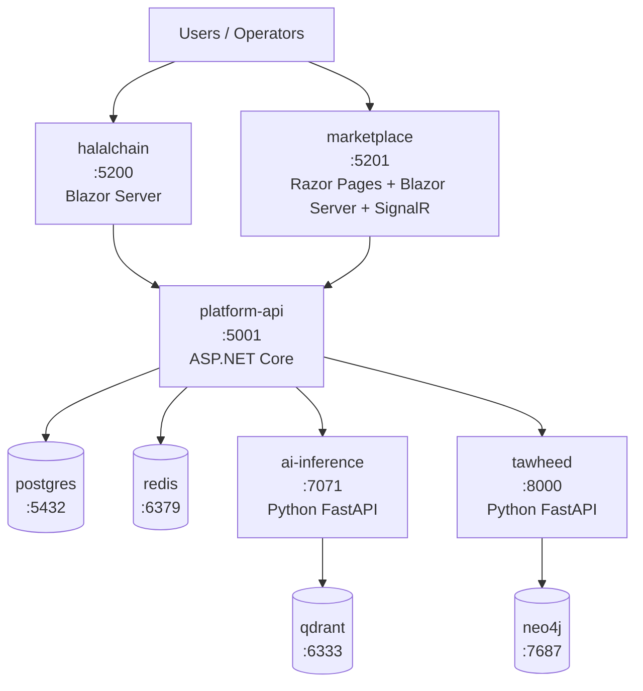

# Runtime Matrix

This matrix is the canonical runtime inventory for the HalalChain repo. It reflects the services currently defined in `docker-compose.yml` and `service-manifest.yaml`.

| Service | Port | Runtime / Stack | Owner | Health Endpoint | Notes |
|---|---:|---|---|---|---|
| `platform-api` | 5001 | ASP.NET Core / .NET 10 | Platform | `/health/live` and `/health/ready` | Core REST API and modular monolith |
| `halalchain` | 5200 | Blazor Server / .NET 10 | Frontend | `/health/live` and `/health/ready` | Customer-facing web UI |
| `marketplace` | 5201 | Razor Pages + Blazor Server + SignalR / .NET 10 | Frontend | `/health/live` and `/health/ready` | Vendor marketplace UI |
| `ai-inference` | 7071 | Python FastAPI + model gateway | AI Systems | `/health/live` and `/health/ready` | Embeddings / classification / rerank |
| `tawheed` | 8000 | Python FastAPI | AI Systems | `/health` | Evidence collection + policy engine |
| `postgres` | 5432 | Postgres 17 | Data | `pg_isready` | Primary relational database |
| `redis` | 6379 | Redis 7 | Data | `PING` | Cache, sessions, and locks |
| `neo4j` | 7687 | Neo4j 5 | Data | `/` over the Bolt/HTTP port | Graph relationships and provenance |
| `qdrant` | 6333 | Qdrant | Data | `/health` | Vector search and embeddings |

## Runtime ownership model

- Platform: API, contracts, shared platform services, and CI/CD ownership.
- Frontend: customer UI and vendor marketplace experiences.
- AI Systems: evidence collection, model routing, and deterministic policy evaluation.
- Data: database and vector-store services that support persistence and retrieval.

## Service dependencies

- `platform-api` depends on `postgres`, `redis`, `ai-inference`, and `tawheed` as optional or required services depending on runtime mode.
- `halalchain` and `marketplace` depend on the API and expose public HTTP endpoints.
- `ai-inference` depends on `redis` and `qdrant` for cache and vector retrieval.
- `tawheed` depends on `postgres`, `redis`, and `neo4j` for policy evaluation and evidence storage.

## Operational note

This doc is intentionally kept alongside `service-manifest.yaml` and `docker-compose.yml` so it can be checked programmatically in CI to catch drift early.
