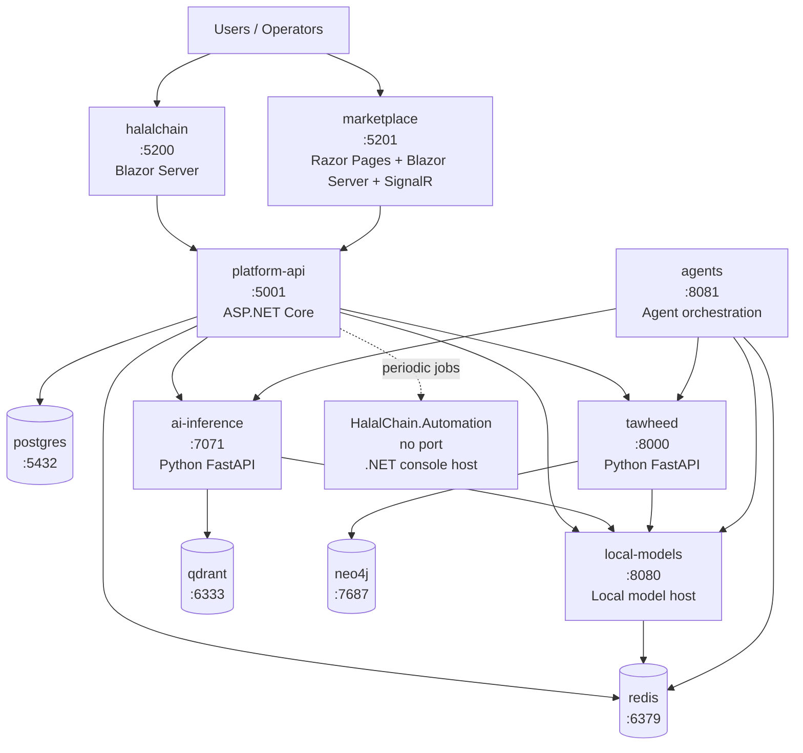

# Runtime Matrix

This matrix is the canonical runtime inventory for the HalalChain repo. It reflects the services currently defined in `docker-compose.yml` and `service-manifest.yaml`.

```mermaid
flowchart TB
    user[Users / Operators] --> halalchain[halalchain\n:5200\nBlazor Server]
    user --> marketplace[marketplace\n:5201\nRazor Pages + Blazor Server + SignalR]

    halalchain --> api[platform-api\n:5001\nASP.NET Core]
    marketplace --> api

    api --> postgres[(postgres\n:5432)]
    api --> redis[(redis\n:6379)]
    api --> ai[ai-inference\n:7071\nPython FastAPI]
    api --> tawheed[tawheed\n:8000\nPython FastAPI]
    api --> localmodels[local-models\n:8080\nLocal model host]
    ai --> qdrant[(qdrant\n:6333)]
    ai --> localmodels
    tawheed --> neo4j[(neo4j\n:7687)]
    tawheed --> localmodels
    localmodels --> redis
    agents[agents\n:8081\nAgent orchestration] --> ai
    agents --> tawheed
    agents --> localmodels
    agents --> redis
    api -.->|periodic jobs| automation[HalalChain.Automation\nno port\n.NET console host]
```

| Service | Port | Runtime / Stack | Owner | Health Endpoint | Notes |
|---|---:|---|---|---|---|
| `platform-api` | 5001 | ASP.NET Core / .NET 10 | Platform | `/health/live` and `/health/ready` | Core REST API and modular monolith |
| `halalchain` | 5200 | Blazor Server / .NET 10 | Frontend | `/health/live` and `/health/ready` | Customer-facing web UI |
| `marketplace` | 5201 | Razor Pages + Blazor Server + SignalR / .NET 10 | Frontend | `/health/live` and `/health/ready` | Vendor marketplace UI |
| `ai-inference` | 7071 | Python FastAPI + model gateway | AI Systems | `/health/live` and `/health/ready` | Embeddings / classification / rerank |
| `tawheed` | 8000 | Python FastAPI | AI Systems | `/health` | Evidence collection + policy engine |
| `local-models` | 8080 | Local model host (`.halalchain/local-models`) | AI Systems | `/health/live` | Hosts local models; backs `LocalModels__BaseUrl` for the API and `LOCAL_MODELS_URL` for the Python services |
| `agents` | 8081 (container `:8080`) | Python FastAPI (`.halalchain/agents`) | AI Systems | `/health/live` | Agent orchestration and evidence collection loop; shares the eval DAG with `HalalChain.Agents` |
| `postgres` | 5432 | Postgres 17 | Data | `pg_isready` | Primary relational database |
| `redis` | 6379 | Redis 7 | Data | `PING` | Cache, sessions, and locks |
| `neo4j` | 7687 | Neo4j 5 | Data | `/` over the Bolt/HTTP port | Graph relationships and provenance |
| `qdrant` | 6333 | Qdrant | Data | `/health` | Vector search and embeddings |

## Non-compose runtime hosts

These run from the .NET solution and are **not** part of the compose stack or
the frozen image list in `service-manifest.yaml`.

| Host | Port | Runtime / Stack | Owner | Health Endpoint | Notes |
|---|---:|---|---|---|---|
| `HalalChain.Automation` | none (outbound only) | .NET 10 console host | Platform | `/health/live` when hosted | Scheduled jobs host: storage retention/archive, dead-letter reprocessing, agent revalidation/escalation, compliance sweeps, and blockchain outbox/anchor jobs. Uses Postgres advisory locks for distributed coordination |
| `HalalChain.Mcp` | none (stdio) | .NET 10 console host | Platform | n/a (stdio MCP server) | Model-Context-Protocol server for LLM tool access |

## Runtime ownership model

- Platform: API, contracts, shared platform services, scheduled job hosts, and CI/CD ownership.
- Frontend: customer UI and vendor marketplace experiences.
- AI Systems: evidence collection, model routing, agent orchestration, and deterministic policy evaluation.
- Data: database and vector-store services that support persistence and retrieval.

## Service dependencies

- `platform-api` depends on `postgres`, `redis`, `ai-inference`, `tawheed`, and `local-models` as optional or required services depending on runtime mode. It reaches local models via `LocalModels__BaseUrl` (`http://local-models:8080`).
- `halalchain` and `marketplace` depend on the API and expose public HTTP endpoints.
- `ai-inference` depends on `redis`, `qdrant`, and `local-models` for cache, vector retrieval, and model hosting.
- `tawheed` depends on `postgres`, `redis`, `neo4j`, and `local-models` for policy evaluation, evidence storage, and model hosting. It calls `ai-inference` for embeddings/reranking.
- `local-models` depends on `redis` for model-result caching. Its health is a startup gate for `platform-api`, `ai-inference`, `tawheed`, and `agents`, which reach it over `http://local-models:8080`.
- `agents` depends on `redis`, `ai-inference`, `tawheed`, and `local-models`. It is the collection loop; it must not assign halal verdicts.
- `HalalChain.Automation` is not a compose service. It connects outbound to `postgres` (advisory locks, job state) and to the platform data it sweeps, and triggers agent revalidation and blockchain outbox work.

## Operational note

This doc is intentionally kept alongside `service-manifest.yaml` and `docker-compose.yml` so it can be checked programmatically in CI to catch drift early.
